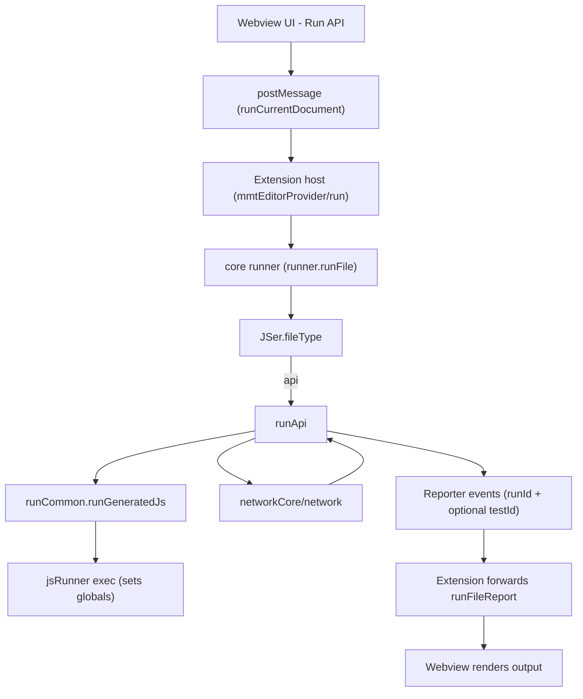
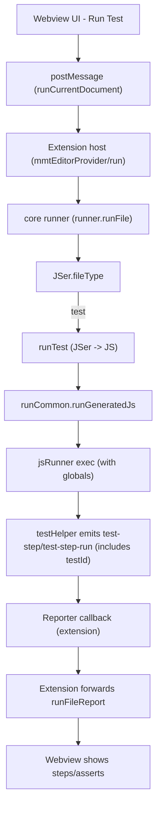
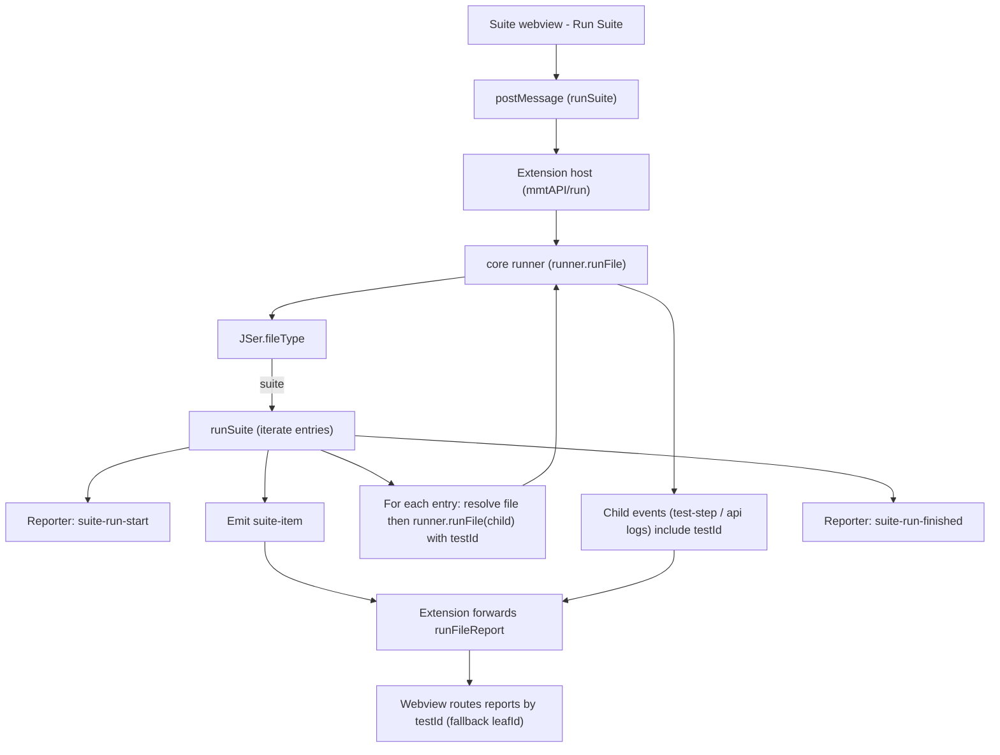
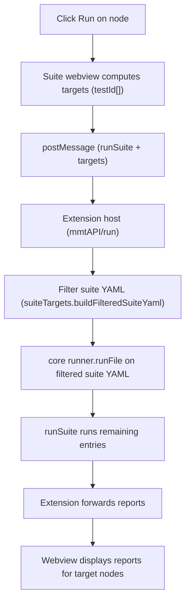

# Copilot Instructions for `multimeter` (mmt)

## Project structure & architecture
- **Monorepo layout**:
  - `core/`: pure TypeScript library with all parsing, execution and network logic (no VS Code, no `fs` – use dependency injection).
  - `mmtview/`: React + VS Code webview UI for editing/running `.mmt` files.
  - `mmtcli/`: CLI app; binary is `testlight`, used for CI and local runs.
  - Root `src/`: VS Code extension host code (activation, editor provider, assistant, network bridge).
- **Single source of truth** for running `.mmt` files is `core/src/runner.ts`:
  - Use `runner.runFile({ rawFile, filePath, inputs, envvar, fileLoader, jsRunner, logger })`.
  - Do **not** reimplement parsing or execution pipelines in the extension or CLI – always go through `runner`.

## Core library (`core/`) patterns
- Keep `core` platform-neutral:
  - No imports from `vscode`, `fs`, `path`, browser APIs, or Node globals that assume a specific runtime.
  - All file access, code execution, logging, and network plumbing come in via injected functions (`fileLoader`, `jsRunner`, `logger`, etc.).
- Key modules to know:
  - `runner.ts`: orchestrates `.mmt` execution, builds API/test runners, and formats logs/docs.
  - `JSer.ts`, `testParsePack.ts`, `apiParsePack.ts`: turn YAML `.mmt` into executable JS flows.
  - `networkCore.ts`, `network.ts`, `NetworkData.ts`: HTTP/WebSocket client, message routing, and shared network config types.
  - `outputExtractor.ts` + `pathAtPosition.test.ts`: JSON/XML/xpath/jsonpath/regex extraction and “path at cursor” helpers.
- When extending behavior:
  - First update the relevant data model types in `core/src/*Data.ts` (e.g. `APIData`, `TestData`, `NetworkConfig`).
  - Add/adjust unit tests in `core/src/*.test.ts` that cover the new pure logic.

## VS Code extension + webview
- Extension host (`src/`):
  - `extension.ts`: entrypoint; registers the `.mmt` custom editor, side panels (history, mock server, environment, certificates), and chat participants from `src/assistant.ts`.
  - `mmtEditorProvider.ts`: glue between webview messages and `runner.runFile`. It:
    - Receives `command` messages like `runCurrentDocument`, `runCurlCommand`, etc.
    - Calls `runner.runFile({ rawFile: document.getText(), filePath: document.uri.fsPath, inputs, envvar, fileLoader, jsRunner, logger })`.
  - `vscodeNetwork.ts`: adapts VS Code configuration and environment to `NetworkConfig` and bridges webview/network messages into `core`.
- Webview React app (`mmtview/src/`):
  - Uses `window.vscode.postMessage` via helpers in `vsAPI.ts` instead of importing `core` directly.
  - `text/YamlEditorPanel.tsx` drives run glyphs for `.mmt` files; it sends structured `inputs` shapes (`type: 'defaults' | 'manual' | 'exampleId' | 'exampleIndex'`) back to the extension.
  - Keep UI logic (layout, focus, interactions) here; keep parsing/execution in `core`.

## CLI (`mmtcli/`) workflow
- Entrypoint: `mmtcli/src/cli.ts` wraps `core` and exposes the `testlight` binary.
- Typical usage (see `mmtcli/README.md` and `docs/testlight.md`):
  - `npx testlight run path/to/test.mmt`
  - Pass env via `--env-file`, `--preset`, and `-e KEY=VALUE` flags; types are coerced by `coerceCliValue`/`parsePairs` in `cli.ts` (unquoted numbers/bools → numbers/bools, quoted → strings).
- If you add new CLI flags, wire them through to `runner.runFile` rather than duplicating parsing/execution.

## `.mmt` data model and docs
- `.mmt` is YAML with `type` driving behavior, parsed by `JSer.fileType`:
  - `type: api` → HTTP/WebSocket API definitions (see `docs/api-mmt.md`).
  - `type: test` → executable test flows (`call`, `assert`, `check`, etc.; see `docs/test-mmt.md`).
  - `type: env` / `type: var` → environment and variable files (see `docs/environment-mmt.md`).
- Converters and docs:
  - `core/src/openapiConvertor.ts`, `postmanConvertor.ts`: turn OpenAPI/Postman into `.mmt` API/test files.
  - `core/src/docHtml.ts`, `docMarkdown.ts`, `docParsePack.ts` and `res/doc-template.html`: generate HTML/Markdown API docs from `.mmt`.

## Network, logging, and errors
- All HTTP/WS traffic flows through `core/src/networkCore.ts` + `core/src/network.ts` using `NetworkConfig` from `NetworkData.ts`.
- HTTP helpers always return a structured `HttpResponse`; network-level failures are normalized (e.g. `status = -1`, descriptive `statusText`) so callers can distinguish unreachable hosts from HTTP errors.
- API runs use `buildApiRunnerWrapper` in `runner.ts`:
  - Log `Request`, `Response`, `Environment`, and `Inputs` sections with consistent key/value formatting.
  - If `status < 0`, the wrapper throws after logging so `RunResult.success` is `false`.
- When extending logs, reuse helpers from `createApiLogHelpers` instead of ad-hoc `console.log`, and treat logs as append-only (especially in the extension output channel).

## Workflow / agent rules

- Do **not** create git commits unless the user explicitly asks to commit.

## Build, test, and packaging
- From repo root:
  - `npm run compile --silent` – build all apps (core, extension, webview, CLI) via the shared pipeline.
  - `npm run test` – run Jest tests (mostly `core/src/*.test.ts`).
- VS Code extension packaging: run `vsce package` at the repo root to create the `.vsix`.
- Avoid per-package custom build scripts; integrate new build steps into the root `package.json`.

## Conventions and change strategy
- Style:
  - 2-space indentation, no tabs; always use braces even for single-line `if`/loops.
  - Always use curly braces for all control structures (e.g. `if`, `else`, `for`, `while`, `do`, `switch`, etc.), even when the body is a single line. This avoids ambiguous or hard-to-read one-line constructs.
  - Keep `core` free of editor/FS/UI dependencies; put VS Code, `fs`, browser, and React code in `src/` or `mmtview/` instead.
  - Commit message style: short, imperative (`Add test auto complete`, `Improve UI of doc view`).
- Change flow:
  - Prefer implementing behavior in `core` first, then wiring it to the extension (`src/`), webview (`mmtview/`), CLI (`mmtcli/`), and finally updating docs under `docs/`.
  - Before refactoring shared APIs like `runner.runFile` or network helpers, search call sites in:
    - `core/src/runner.ts`, `src/mmtEditorProvider.ts`, `src/assistant.ts`, `src/vscodeNetwork.ts`, `mmtcli/src/cli.ts`, `mmtview/src/**`.
  - For new user-facing features (commands, panels, assistant behaviors), keep CLI and VS Code behavior aligned when reasonable and document any intentional differences.

## Real execution flows (current code)

This section captures the current runtime flow through the webview → extension host → `core` runner, including how `testId` flows into reporter events.

### Run an API `.mmt` file (`type: api`)

Notes:
- `testId` is typically injected by suites/tests; plain API runs generally don’t originate a `testId`.

### Run a Test `.mmt` file (`type: test`)

### Run a Suite `.mmt` file (`type: suite`) - full suite run

### Run a “node” in the suite tree - current implementation (targets filtering)

Per-item Run buttons implement “run selected top-level suite entries”, by sending `targets: string[]` (a list of `testId`s) and filtering suite YAML in the extension.

Notes:
- Filtering/bundling currently happens in the extension (not `core`).
- `testId` currently uses the suite-entry index scheme (e.g. `0:3`) and is propagated into child runs so step events can be routed back.

## Suite bundle (planned)

For recursive suite imports and “solid” per-node reporting, the intended direction is a core-native **suite bundle** runner that uses `nodeId` (stable per bundle node) and emits explicit suite lifecycle events.

- `nodeId`: preferred routing id for bundled suite nodes; propagates into `test-step` and `test-step-run` events.
- `suite-run-start` / `suite-run-finished`: suite lifecycle reporter events emitted by core suite execution.
