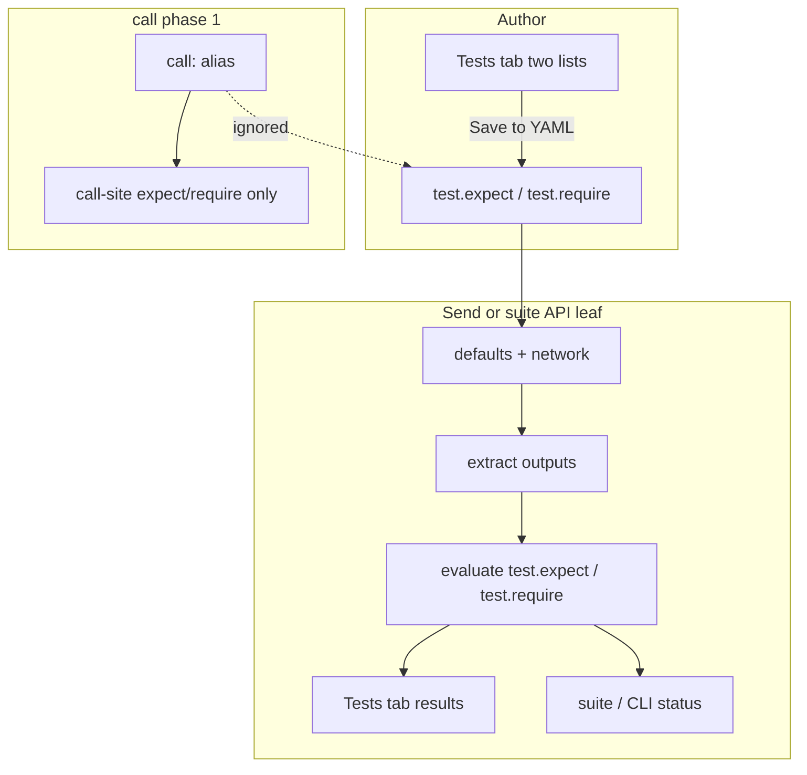

# SDD: API `test` Block + Suite API Items + Tester Tests Tab

**Date:** 2026-09-27  
**Status:** Draft — phase 1 ready to implement pending no further product blockers

---

## Summary

Make `type: api` files Postman-like **request + assertions** units:

1. Optional top-level **`test:`** on the API file, with nested **`expect`** (soft) and **`require`** (hard) — **same field names, map shape, and operators as [`call`](../../docs/files/test/steps/call.md#expect)**.
2. **Suites** can list API files in `items:` and run them with **default inputs** + env, evaluating `test`.
3. API Tester and **edit** UI get a trailing **Tests** tab: two lists (Expect / Require), results after Send, authoring saved via the **existing Save to YAML** flow.
4. Plain **`call: alias` ignores file `test:`**. Phase 2 (later): `call: alias.test` / `call: alias.<exampleName>` — out of scope for phase 1.

**Non-goal:** Change existing `call:` / `http:` step schema or behavior.

---

## Locked decisions

| # | Decision |
|---|----------|
| 1 | Nested under **`test:`**; keys are **`expect`** and **`require`** — same as call (no `expected` / `required`, no aliases). |
| 2 | Soft/hard semantics identical to call with both maps set. |
| 3 | Plain `call: alias` → **ignore** file `test`. Selectors like `call: alias.test` / example calls → **phase 2 later**. |
| 4 | Suite API leaves: **defaults only**. |
| 5 | CLI / Run exit behavior: **same as today’s run**, with `require` failures failing like call/test hard asserts. |
| 6 | **Always show** Tests tab; add/edit rows; save via **existing** Save-to-YAML / apply flow; same UI in **edit** section. |
| 7 | Higher layer on **inputs/outputs** — all protocols (HTTP, WS, GraphQL, gRPC). |
| 8 | Tests UI: **two lists** (Expect list + Require list). |
| 9 | Named multi-test maps / example-linked asserts → **later**. |

---

## Motivation

- Suite docs claim API items are supported; hierarchy currently **drops** `type: api`.
- Asserting an API in a suite today needs a wrapper test.
- No Postman-like Tests surface on Send or in edit mode.

---

## Non-goals (phase 1)

- Changing `call` / `http` step fields or codegen.
- Evaluating API `test` on plain `call: alias`.
- `call: alias.test` / `call: alias.<exampleName>`.
- Multiple named test blocks on one API.
- Suite per-item input overrides.
- Autosave of Tests edits (only existing save/apply).
- Soft-asserting `examples[].outputs` when picking an example.

---

## Design

### 1. API YAML

```yaml
type: api
title: Get user
url: https://test.mmt.dev/json
method: get
inputs:
  id: 1
outputs:
  status_code: status
  user_id: body.id
test:
  expect:
    status_code: 200
    user_id: != omit
  require:
    status_code: == 200
```

| Path | Semantics |
|------|-----------|
| `test.expect` | Soft — same as call `expect`. |
| `test.require` | Hard — same as call `require`. |

- Map shape and operators identical to call.
- Soft + hard share one result group.
- Reuse call inline evaluation helpers (no forked operator logic).
- Pack key order: insert `test` with other API header fields near `outputs` / `examples` per existing order rules.
- Empty `test:` or missing both maps → no assertions.

### 2. Evaluation

After network + output extraction:

1. Build outputs object (declared `outputs:` + default roots as for calls).
2. Evaluate `test.expect` then `test.require`.
3. Emit structured results for Tests tab / suite / CLI.

Transport failure → failed run; prefer one error row.

**Applies (phase 1):** Tester Send/Run, suite `kind: 'api'` leaf, direct CLI/run of the API file.  
**Does not apply:** plain `call: alias` / `http` calling an API.

### 3. Suite: API leaves

- Hierarchy/bundle: `kind: 'api'` (id, path, title; tags later if needed).
- `items:` → `type: api` no longer discarded.
- Run: `api.inputs` defaults + suite/env → network → outputs → `test` → item status like a one-call test with expect+require.
- `then` / partial run by `id` same as tests.

### 4. Tests tab (Tester + Edit)

Always last tab.

**Layout:** two lists — **Expect** and **Require** (labels match YAML keys).

| Mode | Behavior |
|------|----------|
| Results (after Send) | Pass/fail rows in each list; summary counts |
| Empty | Empty state (“No tests on this API.”); no blue link |
| Authoring | Add/remove/edit rows in either list; dirty until **existing Save to YAML** / apply |

Same control in edit-mode API UI. Protocol-agnostic.

### 5. CLI / reports

- Suite reports treat API leaves like tests; include failed expect/require lines.
- Exit codes: align with current Run; `require` failures fail like hard asserts on tests.

### 6. Data model (sketch)

```ts
// APIData
test?: {
  expect?: Record<string, string | number | boolean>;
  require?: Record<string, string | number | boolean>;
};

// Suite hierarchy / bundle
| { kind: 'api'; id: string; path: string; title?: string; tags?: string[] }
```

### 7. Phase 2 (deferred)

- `call: alias.test` — run API and apply file `test`
- `call: alias.<exampleName>` — run with example inputs (example output asserts TBD)
- Optional multiple named test blocks

Documented only so phase 1 naming stays compatible.

---

## Flow



---

## Phasing

| Phase | Scope |
|-------|--------|
| **1a** | Parse/pack `test`; evaluate on Send; Tests tab results |
| **1b** | Two-list authoring in Tester + Edit; save via existing YAML apply |
| **1c** | Suite `kind: 'api'`; defaults; reports/CLI |
| **2** | `call: alias.test` / example selectors (later) |

---

## Docs / examples (when implementing)

- API reference: `test.expect` / `test.require` (point at call docs for operators)
- Suite items: API leaves runnable
- Tester/Edit: Tests tab
- One example API + suite entry

---

## Open questions

None blocking phase 1. Implementers may choose defaults without further product input:

- New row defaults into the **Expect** list unless user is focused in Require.
- Omitting empty `test:` / empty maps on save (same hygiene as other optional maps).

---

## Acceptance (phase 1)

- [ ] `test.expect` / `test.require` pack/parse; call fixtures unchanged
- [ ] Send evaluates into Tests tab (two lists)
- [ ] Authoring in Tester + Edit saves via existing Save to YAML
- [ ] Suite API item runs with defaults and reports like call expect+require
- [ ] Plain `call: alias` ignores file `test`
- [ ] Protocol-agnostic (outputs layer)
- [ ] Docs + one example
