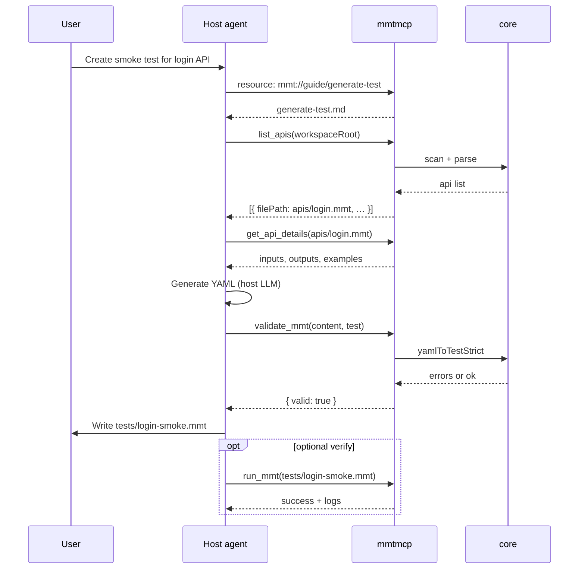

# SDD: MCP Server for AI Test Generation

**Date:** 2026-07-11  
**Status:** Draft — awaiting review

---

## Summary

Replace the VS Code chat participant’s free-form LLM path with a **bundled MCP server** (`mmtmcp`) that exposes Multimeter’s real capabilities (validate, run, convert, project introspection) to AI agents in VS Code and Cursor. Test generation is driven by the host agent using MCP **resources**, **prompts**, and **tools** — not by embedding a small model inside the extension.

**Phase 1:** Ship MCP bundled with the VS Code extension (primary). Add Cursor support via npm package + optional Cursor plugin, without compromising the VS Code zero-config experience.

**Phase 2:** Keep chat participant **commands** (`/run`, `/print-js`, `/doc`, `/help`). For any other message (questions, “generate a test”, etc.), return a deprecation notice pointing users to MCP / Cursor Agent / Copilot agent mode.

---

## Motivation

The current `@Multimeter` / `@mmt` chat participant fails for generation:

| Problem | Cause |
|---------|-------|
| Wrong YAML | Model guesses schema; no call to `validateTestData` |
| Limited context | ~3-line `BASE_PROMPT`; full rules live in `docs/AI/generate-*.md` (~hundreds of lines) |
| No feedback loop | No `run_mmt` → fix → retry cycle |
| Wrong architecture | Extension embeds a weak LLM instead of exposing Multimeter as tools |

The `/run`, `/print-js`, and `/doc` **commands** work — they call `core` directly. Only the free-form `sendRequest` path should be retired.

MCP is the right replacement because:

- Host agents (Copilot, Cursor) use capable models and large context
- Resources load `docs/AI/*` on demand (no token cramming)
- Tools ground generation in `core` parsers and `runner.runFile`
- Same server works in VS Code, Cursor, CI, and other MCP clients

---

## Goals

1. **One MCP server** (`mmtmcp`) built on `core` + patterns from `mmtcli`
2. **VS Code zero-config**: extension bundles server and registers via `mcpServerDefinitionProviders`
3. **Cursor support** without sacrificing VS Code: publish `@mmt/mcp` npm package; optional Cursor plugin references the same binary
4. **Context-aware test generation**: agent can list APIs, read API details, validate YAML, run tests, and iterate
5. **Phase 2 deprecation**: chat commands preserved; free-form chat returns deprecation message

## Non-Goals (v1)

- Replacing palette commands (`multimeter.run`, etc.) — they stay
- HTTP/streamable MCP transport — stdio only for v1
- OAuth or remote-hosted MCP server
- MCP server calling an LLM internally (generation stays in the host agent)
- Auto-writing files without user confirmation (agent uses normal editor write flow)
- Removing `chatParticipants` from `package.json` in phase 1 (only in a later major release)

---

## Architecture

```
┌──────────────────────────────────────────────────────────────────┐
│  Host agent (VS Code Copilot / Cursor Agent)                     │
│  - Reads MCP resources (docs/AI/generate-test.md, …)             │
│  - Invokes MCP prompts (generate-test, generate-from-openapi)    │
│  - Calls MCP tools (validate, run, list_apis, convert, …)        │
└────────────────────────────┬─────────────────────────────────────┘
                             │ MCP (stdio)
┌────────────────────────────▼─────────────────────────────────────┐
│  mmtmcp/  (Node, platform-neutral except fs via injected paths) │
│  - @modelcontextprotocol/sdk                                    │
│  - imports mmt-core (validate, runner, importConvertor, …)       │
└────────────────────────────┬─────────────────────────────────────┘
                             │
┌────────────────────────────▼─────────────────────────────────────┐
│  core/  — single source of truth (no vscode imports)               │
└────────────────────────────────────────────────────────────────────┘

Registration (two paths, one server):

  VS Code extension                Cursor
  ─────────────────                ──────
  registerMcpServerDefinitionProvider   ~/.cursor/mcp.json
  bundled dist/mcp/server.js            or .cursor-plugin/mcpServers
                                        or npx @mmt/mcp
```

### Package layout

```
mmtmcp/
  package.json              # name: @mmt/mcp, bin: mmt-mcp
  tsconfig.json
  src/
    index.ts                # stdio entrypoint
    server.ts               # McpServer setup
    tools/
      validateMmt.ts
      runMmt.ts
      listApis.ts
      getApiDetails.ts
      convertSpec.ts
    resources/
      guides.ts             # serve docs/AI/*.md
    prompts/
      generateTest.ts
      generateFromOpenApi.ts
    fsAdapter.ts            # Node fs fileLoader for core
    jsRunnerAdapter.ts      # Node jsRunner (reuse mmtcli pattern)

src/
  mcpProvider.ts            # vscode.lm.registerMcpServerDefinitionProvider

dist/mcp/
  server.js                 # bundled into VSIX (build step)

.cursor-plugin/             # optional, phase 1 or 1.1
  plugin.json               # mcpServers → npx @mmt/mcp or bundled path
```

---

## MCP Surface

### Server instructions

Short system text registered with the MCP server (shown to the agent):

> You are helping the user author Multimeter `.mmt` files. Before generating YAML, read the relevant guide resource (`generate-test`, `generate-api`, etc.). After generating, always call `validate_mmt`. For tests that call APIs, call `list_apis` and `get_api_details` first. Optionally call `run_mmt` to verify behavior. Use snake_case tokens (`e:api_url`, `i:user_id`). Never add YAML comments (`#`).

### Tools (v1)

| Tool | Purpose | `readOnlyHint` | Core dependency |
|------|---------|----------------|-----------------|
| `validate_mmt` | Parse + validate YAML content | yes | `testParsePack`, `apiParsePack`, `JSer.fileType` |
| `run_mmt` | Execute a `.mmt` file | no | `runner.runFile`, `runConfig` |
| `list_apis` | Scan workspace for `type: api` files | yes | fs walk + `JSer.fileType` / `apiParsePack` |
| `get_api_details` | Return title, method, url, inputs, outputs, examples | yes | `apiParsePack.yamlToAPI`, `testScaffold` |
| `scaffold_test_from_api` | Deterministic smoke-test baseline from an API file | yes | `testScaffold.scaffoldTestFromApi` |
| `convert_spec` | OpenAPI / Postman → `.mmt` files | yes | `importConvertor` |

#### `validate_mmt`

```typescript
input: {
  content: string;           // YAML body
  expectedType?: 'api' | 'test' | 'env' | 'suite' | 'doc' | 'server' | 'loadtest';
}
output: {
  valid: boolean;
  detectedType?: string;
  errors: string[];
  warnings?: string[];
}
```

Uses `yamlToTestStrict` / equivalent strict parsers where available. Returns structured errors the agent can fix.

#### `run_mmt`

```typescript
input: {
  filePath: string;          // absolute or workspace-relative
  workspaceRoot?: string;
  env?: Record<string, string | number | boolean>;
  inputs?: Record<string, string | number | boolean>;
  envFile?: string;
  preset?: string;
  quiet?: boolean;
}
output: {
  success: boolean;
  durationMs: number;
  logs: string[];
  errors: string[];
  failures: string[];
}
```

Reuses `buildCliRunArgs` logic from `mmtcli/src/runArgs.ts` (extract shared helper if needed). Network config: default `DEFAULT_NETWORK_CONFIG`; no VS Code certificate storage in MCP v1 (document limitation).

#### `list_apis`

```typescript
input: {
  workspaceRoot: string;
  glob?: string;             // default: "**/*.mmt"
}
output: {
  apis: Array<{
    filePath: string;
    title: string;
    method?: string;
    url?: string;
    protocol?: string;
  }>;
}
```

Walks from `workspaceRoot`, skips `node_modules` / `.git`. Enables correct `import:` aliases in generated tests.

#### `get_api_details`

```typescript
input: { filePath: string; workspaceRoot?: string; }
output: {
  title: string;
  method?: string;
  url?: string;
  inputs: Record<string, unknown>;
  outputs?: Record<string, string>;
  examples?: unknown[];
  suggestedAlias: string;
  suggestedImportPath: string;  // relative import from suggested test path
  suggestedTestPath: string;    // e.g. tests/login-smoke.mmt
}
```

#### `scaffold_test_from_api`

Deterministic baseline the host LLM enhances (chains, negatives, richer asserts). Lives in `core/src/testScaffold.ts`.

```typescript
input: {
  apiPath: string;
  workspaceRoot?: string;
  testPath?: string;          // default: suggestTestPath(apiPath)
  alias?: string;             // default: suggestAliasFromPath(apiPath)
  strategy?: 'smoke' | 'example';  // default: smoke; example uses first API example inputs
}
output: {
  yaml: string;
  testPath: string;
  alias: string;
  importPath: string;
  warnings: string[];
}
```

Uses `scaffoldTestFromApi()` → `testToYaml()` → optional `validate_mmt` by the agent.

#### `convert_spec`

```typescript
input: {
  sourcePath: string;
  kind: 'openapi' | 'postman';
  workspaceRoot?: string;
  includeTests?: boolean;    // postman only, default false
}
output: {
  files: Array<{ path: string; kind: string; content: string }>;
  warnings: string[];
}
```

### Resources (v1)

Expose existing `docs/AI/*` as MCP resources (content read at startup or lazily from repo-relative paths baked into the package):

| URI | Source file |
|-----|-------------|
| `mmt://guide/general` | `docs/AI/general.md` |
| `mmt://guide/generate` | `docs/AI/generate.md` |
| `mmt://guide/generate-test` | `docs/AI/generate-test.md` |
| `mmt://guide/generate-api` | `docs/AI/generate-api.md` |
| `mmt://guide/generate-env` | `docs/AI/generate-env.md` |
| `mmt://guide/generate-suite` | `docs/AI/generate-suite.md` |
| `mmt://guide/generate-doc` | `docs/AI/generate-doc.md` |
| `mmt://guide/generate-loadtest` | `docs/AI/generate-loadtest.md` |
| `mmt://profile/testgen` | `docs/testgen-profile-ai.md` |

Resource templates (optional v1.1):

- `mmt://api/{filePath}` — live API file content

### Prompts (v1)

MCP prompts replace “ask @Multimeter to generate”:

| Prompt | Description |
|--------|-------------|
| `generate_test` | Args: `apiPath` or `apiAlias`, optional `scenario`. Loads `generate-test` resource + `get_api_details`. |
| `generate_from_openapi` | Args: `specPath`. Calls `convert_spec`, then suggests smoke tests. |
| `generate_api` | Args: `description`. Loads `generate-api` resource. |

Prompt handlers return message arrays instructing the agent to use tools — they do not call an LLM themselves.

---

## Test Generation Workflow (agent-driven)

Typical flow when user asks: *“Create a smoke test for login.mmt”*



This is the core quality improvement: **validate → run → fix** instead of one-shot chat output.

---

## VS Code Integration (primary)

### `package.json` contributions

```json
{
  "contributes": {
    "mcpServerDefinitionProviders": [
      {
        "id": "multimeter",
        "label": "Multimeter"
      }
    ]
  }
}
```

Requires VS Code `^1.101` or whatever version introduced `registerMcpServerDefinitionProvider` (verify against `engines.vscode` before release; bump minimum if needed).

### Extension registration

```typescript
// src/mcpProvider.ts
export function registerMcpProvider(context: vscode.ExtensionContext) {
  const serverPath = context.asAbsolutePath('dist/mcp/server.js');
  context.subscriptions.push(
    vscode.lm.registerMcpServerDefinitionProvider('multimeter', {
      provideMcpServerDefinitions: () => [
        new vscode.McpStdioServerDefinition({
          label: 'Multimeter',
          command: process.execPath,  // bundled Node from VS Code, or 'node'
          args: [serverPath],
          cwd: vscode.workspace.workspaceFolders?.[0]?.uri.fsPath,
        }),
      ],
    }),
  );
}
```

Call from `extension.ts` `activate()`.

### Build pipeline

Add to root `package.json` scripts:

1. `compile-mcp` — esbuild/tsup bundle `mmtmcp/src/index.ts` → `dist/mcp/server.js`
2. Include `dist/mcp/**` in VSIX `files` list
3. Copy `docs/AI/**` into bundle or read from extension path at runtime via `context.asAbsolutePath('docs/AI/...')`

Prefer reading guides from the extension’s shipped `docs/AI/` copy (already in VSIX) so resources stay version-aligned with the extension.

---

## Cursor Integration (secondary, no VS Code sacrifice)

Cursor does not use `registerMcpServerDefinitionProvider`. Support three tiers:

| Tier | Mechanism | User effort |
|------|-----------|-------------|
| **A (recommended)** | Publish `@mmt/mcp` on npm | Add to `~/.cursor/mcp.json` or use Cursor plugin |
| **B** | Cursor plugin (`.cursor-plugin/plugin.json`) | One-click install from marketplace |
| **C** | Command: `Multimeter: Add MCP to Cursor` | Writes `.cursor/mcp.json` in workspace |

**Tier A config** (same server VS Code bundles):

```json
{
  "mcpServers": {
    "multimeter": {
      "type": "stdio",
      "command": "npx",
      "args": ["-y", "@mmt/mcp"]
    }
  }
}
```

**Tier B** — Cursor plugin manifest references the npm package (validated by existing `scripts/validate-cursor-plugin.mjs`).

VS Code users never need Tier A–C; extension registration is automatic. No feature is Cursor-only or VS Code-only at the tool level.

---

## Phase 2: Chat Participant Deprecation

### Behavior matrix

| Input | Phase 1 | Phase 2 |
|-------|---------|---------|
| `/run …` | Execute via `runner.runFile` | Same |
| `/print-js …` | Print generated JS | Same |
| `/doc …` | Generate documentation | Same |
| `/help` | Show help | Updated: mention MCP, remove generation promises |
| Any other text | LLM `sendRequest` (legacy) | **Deprecation message only** |

### Deprecation response (Phase 2)

```markdown
Multimeter chat generation is deprecated.

Use **Copilot agent mode** (VS Code) or **Cursor Agent** with the **Multimeter MCP server** to generate and validate `.mmt` tests.

The Multimeter MCP server is included with this extension. Try:
- "Generate a smoke test for apis/login.mmt"
- MCP prompt: `generate_test`

Commands still work here:
- `/run <file>` — run a test or API
- `/print-js <file>` — print generated JS
- `/doc <file>` — generate API documentation
- `/help` — show command help
```

### Code change

In `handleChatRequest` (`src/assistant/assistant.ts`):

1. Keep command routing (`run`, `print-js`, `doc`, `help`) unchanged
2. Remove `BASE_PROMPT`, history loop, and `request.model.sendRequest`
3. Replace with deprecation `response.markdown(DEPRECATION_MESSAGE)`

Optional: detect if MCP server is running and tailor message (“Multimeter MCP is active” vs “Enable MCP in settings”).

### `package.json` updates (Phase 2)

- Change `description` on `chatParticipants` to mention commands only
- Remove `"AI"` from categories when generation is fully MCP-based (optional, later)
- Keep `onChatParticipant:*` activation events until a major version removes participants entirely

---

## Implementation Plan

### Phase 1 — MCP server + VS Code bundle

| Step | Task |
|------|------|
| 1.1 | Create `mmtmcp/` package with stdio server skeleton |
| 1.2 | Add `core/src/testScaffold.ts` + unit tests |
| 1.3 | Implement `validate_mmt`, `run_mmt` (minimum viable loop) |
| 1.4 | Implement `list_apis`, `get_api_details`, `scaffold_test_from_api` |
| 1.5 | Implement `convert_spec` |
| 1.6 | Wire resources from `docs/AI/*` |
| 1.7 | Add MCP prompts (`generate_test`, `generate_from_openapi`) |
| 1.8 | `src/mcpProvider.ts` + `package.json` `mcpServerDefinitionProviders` |
| 1.9 | Build script: bundle `dist/mcp/server.js` into VSIX |
| 1.10 | Unit tests for tools (mock fs); integration test with sample `.mmt` |
| 1.11 | Publish `@mmt/mcp` to npm |
| 1.12 | (Optional) Cursor plugin scaffold with `mcpServers` |

### Phase 2 — Deprecate chat generation

| Step | Task |
|------|------|
| 2.1 | Replace LLM path with deprecation message |
| 2.2 | Update `/help` and `EXTENSION.md` / website copy |
| 2.3 | CHANGELOG + migration note |
| 2.4 | Remove dead LLM imports / `enabledApiProposals: chatProvider` if unused |

### Phase 3 — Future (out of scope for this SDD)

- Remove `chatParticipants` entirely; migrate `/run` to palette-only
- MCP resource templates for live file content
- Certificate / env injection from VS Code storage into `run_mmt`
- Streamable HTTP MCP for team-shared server

---

## File Changes Summary

| File / path | Change |
|-------------|--------|
| `mmtmcp/**` | **New** MCP server package |
| `src/mcpProvider.ts` | **New** VS Code MCP registration |
| `src/extension.ts` | Call `registerMcpProvider` |
| `package.json` | `mcpServerDefinitionProviders`, build scripts, VSIX files |
| `core/src/testScaffold.ts` | **New** deterministic API → test scaffold |
| `core/src/testScaffold.test.ts` | **New** scaffold unit tests |
| `mmtcli/src/runArgs.ts` | Extract shared run-arg builder for MCP (optional refactor) |
| `.cursor-plugin/plugin.json` | **New** (optional) Cursor marketplace entry |
| `docs/testlight.md` or new `docs/mcp.md` | User-facing MCP setup docs |
| `src/assistant/assistant.ts` | Phase 2: remove LLM, add deprecation |
| `EXTENSION.md` | Document MCP + deprecated chat generation |
| `website/src/sections/AITestGen.tsx` | Update marketing copy (Phase 2) |

---

## Testing Strategy

### Unit tests (`mmtmcp/`)

- `validate_mmt` — valid/invalid test and API YAML
- `validate_mmt` — wrong `expectedType` returns errors
- `list_apis` — finds APIs, ignores non-api `.mmt`
- `get_api_details` — parses inputs/examples
- `convert_spec` — OpenAPI fixture → api files

### Integration tests

- Spawn MCP server over stdio; call `tools/list` and `validate_mmt` via SDK test client
- `run_mmt` against `examples/basic/02_simple_test/echo_test.mmt` (network permitting)

### Manual QA

| Scenario | VS Code | Cursor |
|----------|---------|--------|
| Extension install → MCP appears in agent tools | ✓ | n/a |
| “Generate smoke test for X” with validate loop | ✓ | ✓ (with mcp.json) |
| `/run` chat command still works | ✓ | ✓ |
| Free-form @mmt question → deprecation (Phase 2) | ✓ | ✓ |

---

## Error Handling

| Error | Handling |
|-------|----------|
| Invalid YAML | `validate_mmt` returns `errors[]`; no throw |
| File not found | Tool returns `{ error: "File not found: …" }` |
| `run_mmt` network failure | Structured output with `success: false`, logs |
| No workspace root | `list_apis` / `run_mmt` require `workspaceRoot`; tool description documents this |
| MCP server crash | VS Code shows MCP output channel; extension does not auto-restart v1 |

---

## Security Considerations

- MCP tools run with the user’s local filesystem and network access (same as `testlight`)
- `run_mmt` executes real HTTP requests — document in tool description
- No secrets in MCP config; env vars passed per invocation
- Do not expose arbitrary code execution tools beyond what `runner.runFile` already allows

---

## Open Questions

1. **Minimum VS Code version** for `registerMcpServerDefinitionProvider` — confirm and bump `engines.vscode`.
2. **Node binary**: use `process.execPath` vs require user-installed `node` for bundled server.
3. **Certificate passthrough**: should `run_mmt` read VS Code workspace cert storage (phase 3)?
4. **npm scope**: `@mmt/mcp` vs `mmt-mcp` — align with org package naming.
5. **Chat participant removal timeline**: deprecate in 1.x, remove in 2.0?
6. **Auto Cursor config**: ship Tier C command in phase 1 or defer to plugin only?

---

## Success Criteria

- [ ] VS Code user installs extension → Multimeter MCP tools visible with no manual config
- [ ] Agent can generate a valid `type: test` file using `list_apis` + `get_api_details` + `validate_mmt`
- [ ] Agent can `run_mmt` and receive structured pass/fail output
- [ ] Cursor user can connect via `@mmt/mcp` npm package with documented 3-line config
- [ ] Phase 2: free-form chat returns deprecation; `/run`, `/doc`, `/print-js`, `/help` unchanged
- [ ] No duplication of parse/run logic outside `core`

---

## See Also

- [docs/AI/generate-test.md](../../docs/AI/generate-test.md) — test generation rules (MCP resource)
- [docs/testgen-profile-ai.md](../../docs/testgen-profile-ai.md) — TestGen profile (MCP resource)
- [src/assistant/assistant.ts](../../src/assistant/assistant.ts) — current chat participant
- [mmtcli/src/cli.ts](../../mmtcli/src/cli.ts) — CLI patterns for `run_mmt`
- [VS Code MCP extension guide](https://code.visualstudio.com/api/extension-guides/ai/mcp)
- [Cursor MCP docs](https://cursor.com/docs/mcp)
