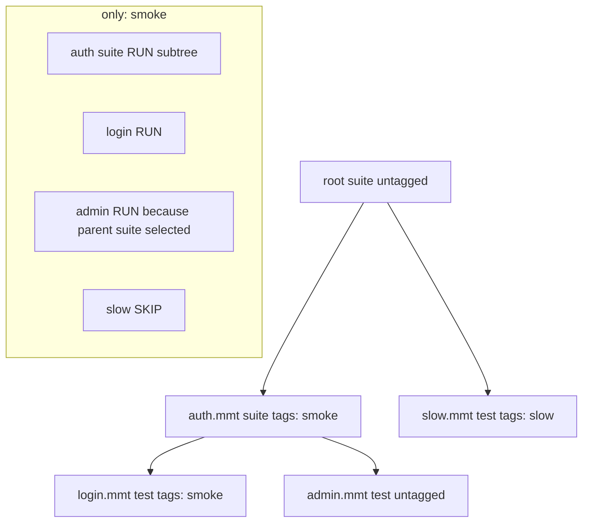

# SDD: Suite Tag Filters (only / skip)

**Date:** 2026-09-15
**Status:** Draft

---

## Summary

Let a suite run select tests and nested suites by `tags:` already declared on `type: test` and `type: suite` files.

Two complementary filters:

- **Only** — run **only** nodes that have at least one of the given tags (and their selected descendants). Everything else is skipped. This is a restriction, not an extra set of files to add on top of a full run.
- **Skip** — do not run any test or suite that has at least one of the given tags.

Skipped nodes are not executed. They appear in the suite tree and reports with a **skip** status icon. The runner **Filter** block (below **Items**) shows **Total: N skipped** after a run when tag filtering skipped items.

Filtering is declared on the suite file (`filter:`, edited in the **Filter** tab of Edit Suite) and can be replaced per invocation by CLI flags and CI action inputs. Core applies one tag-filter pass while walking the suite bundle so CLI, extension, Testlight, and reports stay aligned.

---

## Motivation

`tags:` already exist on tests and suites but they are documentation/search only. CI and local runs need the usual “smoke only” / “skip flaky” selection without editing the suite tree.

Requirements from product:

- Skip any test or suite in the hierarchy that has a given tag.
- Or run only tests/suites that have a given tag.
- Skipped items use a skip icon as status.
- Show skipped count as **Total: N skipped** under the runner **Filter** block (not under overview Total).

Do **not** name the “run only these tags” list `include`. Include reads as “also run these,” while the behavior is “do not run the rest.”

---

## Non-goals

- Tagging individual **steps**, **groups** (`then` stages), or imported **API** files as run units. The unit of skip/run is a **test file** or **suite file**.
- Boolean tag expressions (`smoke and not slow`). v1 is two lists: only-tags and skip-tags.
- Changing how tags are edited on files (chips stay as they are).
- Load-test mode (no suite tree of tests).

---

## Current state

- Tests and suites already have `tags: string[]` (`TestData`, `SuiteData`, docs).
- Suite hierarchy / bundle nodes store `kind`, `id`, `path`, `title` — **not tags**. Tags must be loaded from each file (or cached on the hierarchy node).
- Partial suite runs already skip non-target items (`shouldRunItem` in `runSuite.ts`) but mark them `success: true` without a skipped status.
- `SuiteStepStatus` is `'running' | 'passed' | 'failed' | 'pending' | 'invalid'` — no `skipped`.
- UI `StepStatus` has `cancelled` but not `skipped`. Codicon `codicon-skip` exists.
- MMT / JUnit reports already have `skipped` on the overview, currently always `0`.

---

## Design

### 1. Tag matching

- Tags are **exact, case-sensitive** strings as written in YAML (`smoke` ≠ `Smoke`).
- A node **has** a tag if that string appears in its file’s `tags:` list.
- Empty or missing `tags:` means the node has no tags.

**Defaults** (empty means “do nothing extra”; no sentinel values):

- `only` empty / absent → **all** (every node matches only).
- `skip` empty / absent → **none** (no node matches skip).

**One filter list** (tags written together on the same `only:` or `skip:`):

- Tags in `only:` are **OR** — `matchesOnly` if the node has **any** of those tags (or `only` is empty).
- Tags in `skip:` are **OR** — `matchesSkip` if the node has **any** of those tags (never if `skip` is empty).

**Decision order:** only first, then skip.

```
matchesOnly = only is empty || node has any only-tag
matchesSkip = node has any skip-tag
if (matchesOnly && !matchesSkip) run
else skip
```

Skip always wins after only: a node that matches `only: [smoke]` and also `skip: [wip]` is skipped.

Untagged nodes:

| Filter | Untagged test/suite |
|--------|---------------------|
| No filters (`only` all, `skip` none) | Run |
| Only-tags set | Skip (fails only) |
| Skip tags set | Run (does not match skip) |
| Both | Skip (fails only) |

---

### 2. Hierarchy rules

Apply filters to **suite** and **test** bundle nodes. Groups are transparent (not tagged). `missing` / `cycle` nodes are unchanged (invalid), not skipped.

**Skip tags**

- If a **test** has a skip tag → skip that test (do not execute).
- If a **suite** has a skip tag → skip that suite **and every descendant** without executing them. Nested servers for that subtree are not started.

**Only-tags (run only these tags)**

- If a **test** has an only-tag (and is not skip-tagged) → run it.
- If a **suite** has an only-tag (and is not skip-tagged) → treat the suite as selected: **run the whole subtree**, except descendants excluded by skip tags.
- If a **suite** does **not** have an only-tag → do **not** skip the subtree blindly. **Walk children** so a tagged test/suite deeper in the tree can still run. The untagged parent is a container:
  - If at least one descendant runs → parent is not marked skipped; aggregate status from children that ran (skip does not fail the parent).
  - If every runnable descendant is skipped → parent status is `skipped`.

This matches “skip anything with tag X” and “only run tag Y” without forcing every ancestor to repeat the same tags.



Example: only `smoke` on the tree above → run `auth` suite, `login`, and `admin`; skip `slow`.

Example: skip `slow` only → run everything except `slow.mmt`.

Example: only `smoke` and skip `wip` → selected smoke subtree minus any `wip` node and its descendants.

**Combining filters when a nested suite has `filter:`**

`tags:` on files are always what we match. Each suite `filter:` is a layer. Walking into a nested suite that has `filter:` **and** is actually run (not skipped as a container-only walk) merges that layer onto the active filter for its subtree:

- **`only` layers AND** — must satisfy every non-empty only-list. Empty only on a layer is “all” and does not tighten.
- **`skip` layers OR** — skip if any layer’s skip-list matches.

```
matchesOnly = match(parent.only) && match(nested.only)   // empty only → true
matchesSkip = match(parent.skip) || match(nested.skip)   // empty skip → false
if (matchesOnly && !matchesSkip) run()
else skip()
```

Example: parent `only: [smoke]`, nested `only: [api]` and `skip: [flaky]` → a child runs only if it matches smoke **and** api, and is not flaky. Parent `skip: [wip]` still skips wip (union).

When the nested suite is only a **container** (parent only-filter walking children; this suite itself is not selected), do **not** merge its `filter:`. Parent filter vs child `tags:` only. Nested `filter:` applies when that suite **runs** (selected by only, or this file is the run root / partial-run target).

`testlight run inner.mmt` uses `inner`’s `filter:` as the first layer (plus CLI/UI). Descendants merge further nested `filter:` the same way.

**Partial tree run** (Run on a node): tag filters still apply **inside** the targeted subtree. Targeting does not override skip. If the target is a nested suite, that suite is the root of **that** partial run, so its `filter:` is the first YAML layer, then CLI/UI as in §5.

**Servers**

Skipped work does not start servers. In particular:

- A skipped **test** is not executed, so `run:` mock steps in that test never start.
- A skipped **nested suite** is not executed, so server files in that suite’s `items:` are not started, and descendants do not run.
- Nested suite `servers:` run when that nested suite runs (same as putting those server files at the start of its `items:`). A skipped nested suite does not start them.
- Root-suite `servers:` start only if **at least one** test/suite in the run will actually execute. An all-skipped run starts no root servers.

If a nested suite is not skipped (selected by only, or walked as a container with a running child), its `servers:` and inline `items:` servers still start as they do today for that subtree.

---

### 3. Status: `skipped`

Add `skipped` next to existing statuses. It is **not** `cancelled` (user abort) and **not** `failed`.

| Layer | Change |
|-------|--------|
| `core` `SuiteStepStatus` | add `'skipped'` |
| `mmtview` `StepStatus` | add `'skipped'` |
| Reporter `scope: 'suite-item'` | emit `status: 'skipped'` for filtered-out nodes (and descendants of a skipped suite) |
| `classifySuiteItemStatus` / `worstSuiteItemStatus` | skipped is weaker than passed/failed/invalid; a parent with only skipped children is `skipped`; mixed skipped + passed → `passed`; skipped + failed → `failed` |
| Run success | skipped nodes do **not** fail the suite. All-skipped run → `success: true` |
| UI icon | `codicon-skip`, muted gray (description foreground), title `Skipped` |
| Report status filter | add **Skipped** (and keep Errors / Failed as they are) |

Do not start, run, or cache a skipped test. Do not emit check/assert steps for it.

---

### 4. Overview vs filter summary (implemented)

**Overview boxes** (same step semantics as test runner):

- **Passed** / **Failed** — check/assert step counts; pass/fail rate uses `passed + failed` only (skipped items do not reduce pass rate).
- **Total** — executed step count (`passed + failed`).
- **Total subtitle** — `N test file(s)` in the suite tree (runnable tests + nested suites), not skipped count.

**Runner Filter block** (when `filter:` is configured, above **Items**):

- Read-only **Only:** / **Skip:** tag lists.
- After a run: **Total: N skipped** when `N > 0` (top-level skipped items; do not double-count descendants of a skipped parent).

Exported HTML/MMT reports keep their own overview fields; this section describes the VS Code suite panel only.

---

### 5. Where filters are set

How layers stack:

1. Start from defaults: `only` = all, `skip` = none.
2. **Run-root** suite `filter:` (the file you ran, or the suite node you targeted) becomes the first YAML layer.
3. **CLI / CI** flags for this invocation **replace** the run-root `only` and `skip` lists when provided (not merged with the run-root file).
4. Each **nested suite that actually runs** and has `filter:` merges: `only` **AND**, `skip` **OR**.

An inner suite cannot be forced to run tests it `filter.skip`s. Nested `filter.only` can only **narrow** (AND), never widen.

#### 5.1 CLI (`testlight run`)

```text
-t, --tag <tag>         Only: run tests/suites with this tag (repeatable, OR)
    --skip-tag <tag>    Skip tests/suites with this tag (repeatable, OR)
```

`--tag` maps to `filter.only`. Naming it `--include-tag` is avoided for the same reason as YAML `include`.

Examples:

```bash
npx testlight run suite.mmt --tag smoke
npx testlight run suite.mmt --skip-tag slow --skip-tag flaky
npx testlight run suite.mmt --tag smoke --skip-tag wip
```

Wire through `runner.runFile` / suite bundle options — do not re-filter in the CLI after the fact.

GitHub Action and Azure task get the same inputs (`tag`, `skip-tag`, comma-separated or repeated).

#### 5.2 Suite YAML

```yaml
type: suite
title: Regression
tags: [ci]                 # labels on this suite (unchanged)
filter:
  only:
    - smoke
  skip:
    - flaky
```

List shorthand is only-tags:

```yaml
filter:
  - smoke
  - api
```

same as `filter.only: [smoke, api]`.

| Field | Type | Meaning |
|-------|------|---------|
| `filter.only` | `string[]` | Only-tags (same as `--tag`). Empty = all. Tags in the list are OR. Nested layers AND. |
| `filter.skip` | `string[]` | Skip tags (same as `--skip-tag`). Empty = none. Tags in the list are OR. Nested layers OR. |

`tags:` on the suite/test file is never the filter. It is only the label list matched by filters.

CLI/UI flags replace the run-root `filter:` lists when provided. Nested running suites still merge as AND/OR.

#### 5.3 VS Code suite panel

Edit Suite gets a **Filter** tab (`codicon-filter`), between **Items** and **Servers**, alongside Servers / Environment / Exports:

- **Only tags** and **Skip tags** chip inputs (same widget as file `tags:`), writing `filter.only` / `filter.skip` back to the suite YAML.
- Empty only = no only-filter (run all, then apply skip). Empty skip = no skip filter. Both empty removes `filter:`.

On the runner side of the panel, the active `filter:` is listed read-only above **Items**, the same way `environment:` and `servers:` are shown. During/after a run, skipped rows use the skip icon immediately (no “running” flash). Misordered YAML keys (including `filter:` after `items:`) surface **YAML ERROR** in the run bar.

---

### 6. Core implementation sketch

1. **Hierarchy / bundle** — attach `tags?: string[]` on suite and test nodes when building `suiteHierarchy` (read from parsed suite/test YAML; HTTP/Bruno imports use their converted `tags`).
2. **`TagFilter`** in core (pure):

   ```ts
   type TagFilter = { only?: string[]; skip?: string[] }; // empty only = all, empty skip = none

   function nodeMatchesAny(tags: string[] | undefined, wanted: string[]): boolean
   function mergeFilter(parent: TagFilter, nested: TagFilter): TagFilter
   // merge: only = AND of non-empty lists; skip = OR (union of tags)
   function decideTagRun(node, filter, parentSelected: boolean): 'run' | 'skip' | 'descend'
   // run iff matchesOnly && !matchesSkip
   ```

   - `run` — execute this node (suite: run children except skip; test: execute).
   - `skip` — emit skipped, do not execute, skip descendants.
   - `descend` — untagged-or-unmatched suite under an only-filter: do not execute as a selected suite; evaluate children.

3. **`executeSuiteBundle` / `runSuite`** — before `runFile` on a child, apply `decideTagRun`. On skip, reporter `suite-item` with `status: 'skipped'` (and recurse to mark descendants skipped for the tree UI).
4. **`RunFileOptions`** — add `tagFilter?: TagFilter` so one-file `type: test` runs can also honor `--tag` / `--skip-tag` (skip the whole file → skipped status, success true).
5. **Reports** — `overview.skipped` = skipped test files; check/suite entry `result: skipped`; JUnit `<skipped/>` / `skipped=` count.

Keep core free of VS Code; inject nothing extra beyond options already passed into `runner.runFile`.

---

### 7. UI / reports / docs

| Surface | Change |
|---------|--------|
| Suite tree | Skip icon + tooltip `Skipped (tag)` when possible |
| OverviewBoxes | **Total** = executed steps; `totalSub` = `N test file(s)` |
| Filter block | **Total: N skipped** after a run when tag filter skipped items |
| Report status filter | option `skipped` / “Skipped” |
| MMT report YAML | real `skipped` counts; `result: skipped` |
| HTML / Markdown / JUnit | same |
| Docs | `docs/files/suite/` filter field; `docs/features/testlight/` flags; test/suite `tags:` pages note that tags drive runs |

---

## Implementation order

1. Core `TagFilter` + tags on hierarchy nodes + skipped status on suite-item reporter; unit tests for only/skip/descend.
2. CLI flags + `filter:` parse on suite YAML.
3. VS Code Edit Suite Filter tab + runner filter section (above Items) + skip icon + **Total: N skipped** row.
4. Reports (MMT/JUnit/HTML/MD) skipped counts and results.
5. GitHub Action / Azure inputs + user docs.

---

## Open questions (defaults above)

These are the defaults encoded in this SDD. Change them before implementation if needed:

1. **Only-tags on a tagged suite runs the whole subtree** (except skip-tagged descendants), including untagged children. Alternative: only run descendants that themselves have an only-tag.
2. **Tags inside one `only:` or `skip:` list are OR.** AND is only between nested `filter.only` layers. Alternative: require every tag in a single `only:` list.
3. **CLI/CI overrides replace** the **run-root** `filter:` lists rather than merge. Nested running suites still AND only / OR skip. VS Code has no per-run override: it edits `filter:` in the Filter tab.
4. **All-skipped suite is success.** Alternative: fail or warn-only.
5. **Skipped count lives in the Filter block** (`Total: N skipped`), not in overview **Total** subtitle (subtitle stays `N test file(s)`). Alternative: show skipped under overview Total.
6. **Nested `filter:` merges only when that nested suite actually runs**, not when it is a container walk. Alternative: always AND/OR as soon as the walker enters the file.
