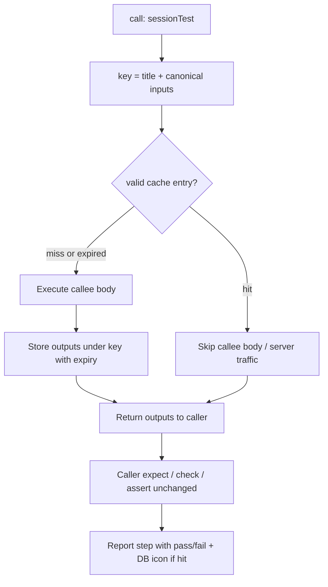

# SDD: Test Call Cache

## Summary

Add an optional top-level `cache` field on `type: test` files (placed with other header fields, immediately before `steps` / `stages`). When a cached test is **called** again within the same root test run with the same title + inputs, Multimeter returns the previous outputs instead of re-executing the callee’s network/server work. Call-site expects, checks, asserts, and reporting still run as usual. Report UIs use dedicated `db_pass` / `db_error` icons when a step was served from cache.

**Status:** Phase 1 — implemented (core runtime, reporter `cached` flag, report UI/HTML/MD markers).

## Motivation

Login/session and other expensive setup tests are often imported and called from many places in one run. Today every `call:` re-executes the full callee (and its HTTP/WS traffic). Competitors solve this with patterns like Karate `callSingle` / `callSingleCache`, Cypress `cy.session`, and Playwright `storageState`. Multimeter needs a small, YAML-native equivalent that:

- Declares TTL/expiry on the **callee** test (not a special call-site API)
- Keys reuse by **title + inputs** so different credentials do not share results
- Stays scoped to **one root test run** (simple, no disk, no cross-Run persistence in phase 1)
- Makes cache hits visible in every report surface that already shows pass/fail icons

## Syntax (phase 1)

Scalar only. Detection order:

| Form | Detection | Meaning |
|------|-----------|---------|
| Duration | Same grammar as `repeat` / `delay` via `parseDurationString` / `isDurationExpression` (e.g. `1s`, `1m`, `2m`, `1h`, `1h5m`) | Expire at `now + duration` |
| Date/time text | String contains `:` (e.g. ISO `2026-08-01T12:00:00Z`, `2026-08-01 12:00:00`) | Absolute expiry wall-clock |
| Epoch | Bare number (YAML number or numeric string with no unit and no `:`) | Absolute Unix epoch: treat as **seconds** if `< 1e12`, else **milliseconds** |

```yaml
type: test
title: Create session
description: Login once per distinct inputs within the run
cache: 5m          # duration → now + 5 minutes
# cache: 1735689600              # epoch seconds
# cache: 2026-12-31T23:59:59Z  # standard time (contains :)
inputs:
  user: e:USER
  pass: e:PASS
steps:
  - call: login_api
    id: auth
    inputs:
      username: i:user
      password: i:pass
outputs:
  token: ''
# populate outputs after the call (avoid TDZ on step ids in the outputs map)
# - js: outputs.token = auth.token
```

Placement: after `inputs` / `outputs` / `import` as needed, **immediately before** `steps` or `stages`.

### Out of scope for phase 1

- Object form (`cache: { as, for }`) and named slots
- Hit-count limits (`for: 100`)
- `cache` on `type: api`
- Disk / cross-process / cross-Run persistence
- Cache on suite `runFile` children that are not inlined `call:` targets (suite items still get icons only when their nested calls report cache hits)

## Semantics



### When cache applies

- Only for **imported `type: test` callees** that declare `cache`.
- Lookup happens when that test function is **called** (not when the file is run as the root document). Direct Run of the cached file always executes (and may refresh the in-run store on success for later callers in the same generated program — see implementation note below).
- **Key:** `title` (YAML `title:` of the callee) + canonical serialization of the **call inputs** object actually passed into the function (after omit/token resolution at the call site). Same title + same inputs → same cached outputs.
- **Value:** the outputs object returned by the callee (same shape as a normal return).
- **Lifetime:** in-memory map for the duration of the **current root `jsRunner` execution** (one VS Code Run / one CLI `testlight run` of a root test). Cleared when the run ends.
- **Expiry:** entry is invalid when `Date.now() >= expiresAt`.

### What is bypassed vs unchanged

On a **cache hit**:

- **Bypassed:** re-execution of the callee test body — no nested `call`/`http`/`run` network or server work inside that callee for this invocation.
- **Unchanged:** caller-side flow after the call returns (expects, checks, asserts, debug, subsequent steps), logging of the call step outcome, and suite/test report aggregation. From the caller’s perspective the call still “happened” and still has pass/fail based on expects.

On a **cache miss:** full callee execution, then store outputs + expiry if the invocation completes and returns outputs (including cases where caller expects later fail — the callee return is what is cached). Do **not** require the caller’s expect to pass before storing.

### Failure / abort

- If the callee throws / aborts before returning outputs, do not write a cache entry.
- A prior successful entry remains until expiry even if a later caller’s expect fails (failure is at the call site, not a reason to invalidate).

## Implementation sketch

| Area | Change |
|------|--------|
| Schema | [`TestData.ts`](../../core/src/TestData.ts); AJV [`TestSchema`](../../mmtview/src/text/Schema.tsx); parse allowlist in [`testParsePack.ts`](../../core/src/testParsePack.ts); format/order in [`mmtFormatAst.ts`](../../core/src/mmtFormatAst.ts) + [`validator.ts`](../../mmtview/src/text/validator.ts) `getCanonicalOrder` |
| Autocomplete | Top-level `cache` suggestion in [`AutoComplete.tsx`](../../mmtview/src/text/AutoComplete.tsx) |
| Parse expiry | New helper next to [`parseDurationString`](../../core/src/JSerHelper.ts): duration → `now+ms`; `:` → `Date.parse`; bare number → epoch s/ms |
| Runtime store | Map in [`testHelper.ts`](../../core/src/testHelper.ts) keyed by `title + '\0' + stableJson(inputs)`; helpers `getTestCallCache_` / `setTestCallCache_` injected like other `_` globals |
| Codegen | [`JSerTest.ts`](../../core/src/JSerTest.ts): for imported tests (`root === false`) with `cache`, wrap function entry: lookup → return clone of outputs; on return path store with computed `expiresAt` |
| Reporter | Emit cache metadata on the call step (e.g. `cached: true` on test-step / expect events or a dedicated field on the call result) so UI/CLI reports can show the icon without guessing |
| UI | Cached steps use dedicated `db_pass` / `db_error` icons (inlined in [`statusIcons.ts`](../../core/src/statusIcons.ts)) instead of normal pass/fail glyphs |
| Docs / examples | [`docs/files/test.md`](../../docs/files/test.md); [`examples/intermediate/24_test_call_cache`](../../examples/intermediate/24_test_call_cache) |

### Key canonicalization

- Sort object keys deeply; normalize omit sentinels consistently with runtime inputs.
- Inputs not passed use callee defaults **after** the same resolution the live call would use (so `{}` vs explicit defaults that equal defaults share a key only if the resolved maps match).

### Direct Run vs call

- **Called** (`root === false`): honor cache lookup + store.
- **Root Run:** always execute body (debuggable). Optionally still **store** on successful return so a later imported call in the same process… *(phase 1: root runs are separate `runFile` invocations — store only within one root JS program. Root Run of the session test alone does not need to populate cache for a different file’s later Run.)*

## Reporting

Wherever a step shows passed/failed (or equivalent) status icons:

- If the step was served from cache, replace the normal pass/fail icon with **`db_pass`** (success) or **`db_error`** (failure) — dedicated database+check / database+X glyphs (inlined in `statusIcons.ts`).
- Tooltip / title: e.g. `Passed (served from cache)`.
- Applies to: test flow report rows and HTML reports; Markdown uses a compact textual marker.

## Docs and examples

- User docs: `cache` section in `docs/files/test.md` + reference list entry.
- Advanced example: `examples/intermediate/24_test_call_cache` — session-style test with `cache: 5m`, parent test calling it twice with the same inputs (second call cache hit) and once with different inputs (miss).

## Competitors (brief)

| Tool | Mechanism |
|------|-----------|
| Karate | `callSingle` + optional `callSingleCache` minutes on disk |
| Cypress | `cy.session(id, setup)` |
| Playwright | `storageState` / setup projects |
| Postman | Manual env token + expiry scripting |

Multimeter phase 1 is closer to in-run `callSingle` with TTL/absolute expiry declared on the callee.

## Open follow-ups (later phases)

- Named slots / shared session across different titles
- Hit counts; disk TTL (Karate-style)
- `cache` on `type: api`
- Explicit cache clear helper / UI
- Suite-bundle sharing across separate `runFile` child processes (would need a host-level store)
