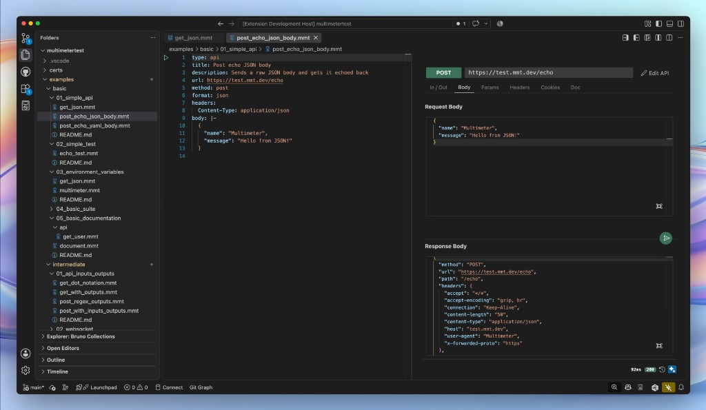

<div align="center">
  <a href="https://mmt.dev">
    
  </a>
  <h4> Start with a request. Grow into a testing platform. Never switch tools.</h4>
  <p>
    <a href="https://mmt.dev/demos"> View Demo</a>
    &middot;
    <a href="https://mmt.dev"> Website</a>
    &middot;
    <a href="https://github.com/mshobeyri/multimeter/issues/new?labels=enhancement&template=feature-request.md"> Request Feature</a>
  </p>
</div>

<p align="center">
  <a href="https://www.youtube.com/watch?v=07Q-Xy0SIcs">
    
  </a>
</p>

## 🚀 Simplicity along with Power.
---

**Multimeter** combines the simplicity of Git-native tools like Bruno with the power of a complete API testing platform like Postman.

Start with a single HTTP request.  Grow into tests, suites, mocks, reports, auto-generated documentation, and CI workflows when you need them.

All in the same tool. No migration required.

| **👮 Coming from Postman?** | **🦮 Coming from Bruno?** |
|-|-|
| ✔️ Powerful ecosystem<br>✔️ Rich API tooling<br>✔️ Collaboration features<br>|  ✔️ Git-native<br>✔️ Lightweight<br>✔️ Simple<br>|
|✖️ Huge collections<br> ✖️ JavaScript everywhere<br>✖️ CI/local mismatch<br>✖️ Environment sprawl<br>✖️ Tests tied to a platform<br>✖️ Hidden states scattered |✖️ Repeated request definitions<br>✖️ Multi-step API workflows<br>✖️ Large test suites<br>✖️ Keeping mocks in sync<br>✖️ CI reports<br>✖️ Generated documentation |

[See full comparision](https://mmt.dev/#comparison)

## 🎯 Why Multimeter?
---

**Everything to start simply**

- ✔️ Git-native
- ✔️ File-based
- ✔️ Lightweight
- ✔️ No cloud lock-in

**Everything teams eventually need as projects grow**

- ✔️ API testing
- ✔️ Test suites
- ✔️ Mock servers
- ✔️ Documentation
- ✔️ Reports
- ✔️ CI workflows
- ➕ [& More...](https://mmt.dev/#features)

## 🪜 Start simple, grow easily...
---

Multimeter is a VS Code-native extension. All you need is:
1. Click Install button in [Multimeter VS Code Extension](https://marketplace.visualstudio.com/items?itemName=mshobeyri.multimeter)
2. Create a `.mmt` file
3. Type:

```yaml
type: api
url: https://test.mmt.dev/echo
method: get
```

That's enough for manual API testing. **Need automated tests?**

Type the following to test if the status is `200`.

```yaml
type: test
steps:
  - http: https://test.mmt.dev/echo
    method: get
    expect:
      status: 200
```

- Still simple.
- Still Git-native.
- Still easy to review.

As your project grows, Multimeter grows with it.

- Test suites
- Mock servers
- Documentation
- Workflow execution
- Structured reporting
- CI artifacts
- [& More...](https://github.com/mshobeyri/multimeter/tree/dev/examples)

Add only when you need them. **Everything stays in the same ecosystem.** 

## 🔁 Built for reliable CI
---

Multimeter validates test definitions before execution.

That means:

- Earlier feedback
- More deterministic execution
- Fewer surprises in CI
- Easier debugging
- Reproducible results

##  Why Git?
---

Your code, tests, mocks, documentation, reports, and environment settings live in the **same repository.**

- Version controlled
- Code and tests evolve together
- Reviewable through pull requests
- Easy to move and share
- No platform lock-in
- AI can update code and tests together
- Environment variables never go missing
- Historical test results stay with the project

## 🧠 Philosophy
---

Most API tools focus on requests. Multimeter focuses on **behavior**.

Instead of asking:

> "Did this request return the expected response?"

Multimeter helps you answer:

> "Does this system still behave correctly?"

---

[Demos](https://mmt.dev/demos) · [Documentation](https://github.com/mshobeyri/multimeter/tree/dev/docs) · [Website](https://mmt.dev)
