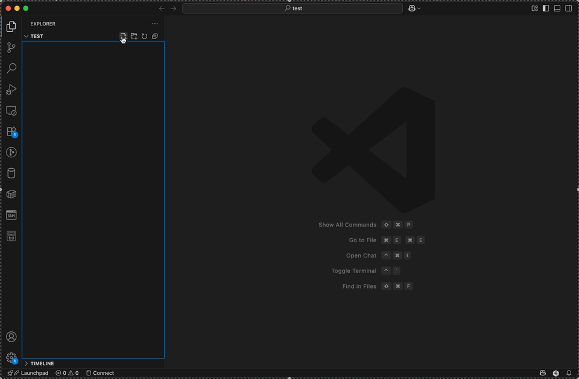

#  Multimeter

**Multimeter** simplifies the process of writing, running, and managing structured HTTP/WebSocket tests directly within Visual Studio Code. Tests will be stored in your application's repository as version-controlled yaml based files like the following:
```yaml
type: api
protocol: http
url: http://localhost:8080
method: post
format: json
body: 
  username: mehrdad
  password: 123456
```

Here is a simple example of a post request, and you can see how it is being executed here;



<a href="https://marketplace.visualstudio.com/items?itemName=mshobeyri.multimeter" style="display: inline-block; background-color: #0078d4; color: white; padding: 10px 20px; margin-top: 25px; text-align: center; text-decoration: none; border-radius: 5px; font-weight: bold; font-size: 16px; box-shadow: 0 4px 6px rgba(0, 0, 0, 0.1); transition: background-color 0.3s, transform 0.3s;">
  Let's Try It!
</a>


## 🚀 Features

- 🧩 UI editor ( No code mode ) along with text editor.
- 💾 Store test cases as files in your application git repo.
  - ⏳ Preserve tests' history in the git repo.
  - 🤖 Ability to generate tests using AI.
  - 📦 Having tests along with the changes in a same pull request.
  - 🔑 Access control can be handled by git.
- 🧱 JSON/XML schema-aware editing.
- 🔗 Chaining request responses.
- ⛓️ Running tests in the pipeline using testlight.
- 🗄 Environment variable and presets support.
- ⛏️ Extract data from results using xpath, jsonpath and regular expression.
- 🌐 HTTP/WS protocols support.
- 🔄 Support Postman and OpenAPI collection convert.
- 🧪 Supports all kinds of test logic, from simple checks to complex flows.
- 🪞 Server mocking.

## 🎯 Upcoming Features
- 📃 Auto documentation.
- 🏋 Load testing.

## 🛠️ Usage
- Add [Multimeter](https://marketplace.visualstudio.com/items?itemName=mshobeyri.multimeter) extension to your vscode.
- Create a .mmt file in your project (e.g., login.mmt).
- Follow the UI instructions 👌.

**Special thanks to: Dear Ashkan Palganeh 👨🏻‍🦱.**

## 📚 Documentation
- [MMT Overview](docs/mmt-overview.md)
  - [API](docs/api-mmt.md)
  - [Test](docs/test-mmt.md)
  - [Environment](docs/environment-mmt.md)
- [Convertor](docs/convertor.md)
- [Mock Server](docs/mock-server.md)
