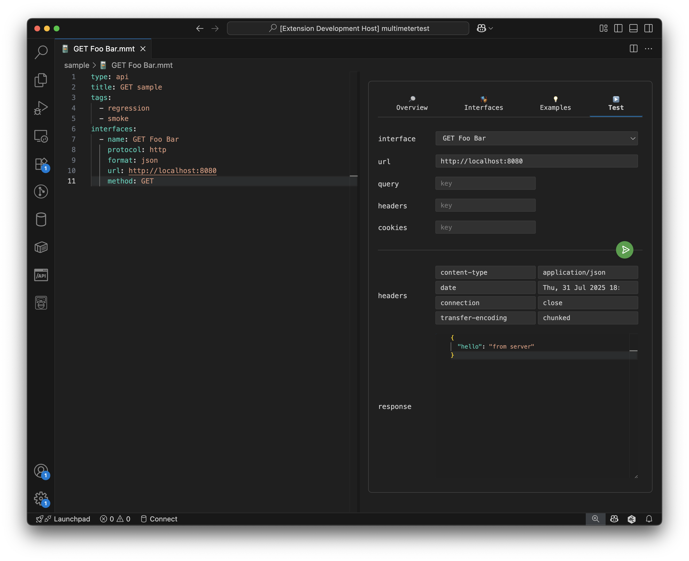

#  Multimeter

**Multimeter** is a powerful Visual Studio Code extension designed to write, run, and manage structured tests using `.mmt` files. It supports a wide range of test types — including API, integration, functional, and custom tests — all stored directly in your application's repository as version-controlled files.

## 🚀 Features

- 🧩 UI editor along with text editor.
- 🧪 Supports all kinds of test logic, from simple checks to complex flows.
- 💾 Store test cases as files in your application git repo.
  - ⏳ Preserve tests' history in the git repo.
  - 🤖 Ability to generate tests using AI.
  - 📦 Having tests along with the changes in a same pull request.
- 🧱 JSON/XML schema-aware editing.
- ⛏️ Extract data from results using xpath, jsonpath and regular expression.
- 🌐 HTTP/WS protocols support.
- 🔄 Support Postman and OpenAPI collection convert.
- 🪞 Server mocking.

## 🛠️ Usage
- Add [Multimeter](https://marketplace.visualstudio.com/items?itemName=mshobeyri.multimeter) extention to your vscode.
- Create a .mmt file in your project (e.g., login.mmt).
- Follow the UI instructions 👌.

## ✍️ Example

Here is the most simple test file you can have.
```yaml
type: api
title: GET sample
tags:
  - regression
  - smoke
protocol: http
format: json
url: http://localhost:8080
method: get
```

Here you can see the screen shot of using this sample. On the right side, beside a UI for modifying the test yaml file interactively, you can have some smoke tests.

 

**Special thanks to: Dear Ashkan Palganeh 👨🏻‍🦱.**