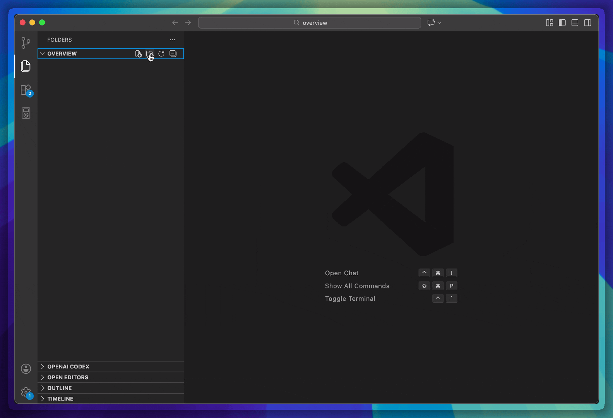

<br />
<div align="center">
  <a href="https://mmt.dev">
    
  </a>
  <p align="center">
    <h4>All possible tests for your service as code!</h4>
    <br />
    <a href="#-documentation"><strong>Explore the docs »</strong></a>
    <br />
    <br />
      <a href="https://github.com/mshobeyri/multimeter/blob/master/docs/demos.md"> View Demo</a>
    &middot;
      <a href="https://github.com/mshobeyri/multimeter/issues/new?labels=enhancement&template=feature-request---.md"> Request Feature</a>
  </p>
</div>

**Multimeter** simplifies the process of writing, running, and managing structured HTTP/WebSocket tests directly within Visual Studio Code. The idea is coming from the Docker world, where the complexity of managing machines is now simple YAML files. Here also, tests will be stored in your application's repository as version-controlled YAML-based files.
## Getting started

```yaml
type: api
protocol: http
url: http://localhost:8080
method: post
format: json
body: 
  username: mehrdad
  password: 123456
```
</br>
Here is a how you can run the test in VSCode;
</br></br>

</br></br>

## 🤔 Why Multimeter?

- 💰 **The extention is free and remains free** — no paywalls, no limitation.
- 👤 **Zero setup friction.** No login or account needed — your Git repo controls access.  
- 🦾 **Generate tests automatically.** Ask AI to build tests, refine your code, deploy and run until everything passes.  
- 🌈 **One tool instead of many.** Replace Postman, JMeter, NeoLoad, Robot Framework etc. — no juggling of tools.  
- 🪞 **Instant mock servers.** Built-in HTTP / WebSocket mock server lets you simulate responses quickly (ideal for edge-cases).  
- 🔄 **Seamless migration support.** Already have Postman collections or OpenAPI specs? Convert them to Multimeter tests without rewriting.  
- 📄 **Auto-generated API docs.** Produce clean HTML or Markdown API docs from your tests — always up to date.  
- 🪢 **Reusable & modular tests.** Write once — reuse elsewhere with different inputs, like calling a function.  
- 📦 **Versioned tests alongside code.** Tests live in the same repo and can be updated in the same pull request — you retain ability to test older versions.  
- 🖌️ **Easy bulk edits.** Want to update many tests at once? Use VS Code’s “Replace All” instead of manual edits.  
- ⏳ **Full test history.** Store test results in your repo so you always have access to past runs.  
- 👮‍♂️ **Your data stays yours — secure & private.** Sensitive info stays in your repo; nothing is uploaded externally.  
- 🎛️ **No coding skills needed.** Modern graphical UI lets even non-coders create and run tests.  
- ⛓️ **CI/CD ready.** Integrate with your pipeline via `testlight` to automatically run tests before merging — ensuring quality before merge.  

## 🚀 (Some Of) Features' Demo

 - 🧩 UI editor ( No code mode ) along with text editor. <a href="https://github.com/mshobeyri/multimeter/blob/master/docs/demos.md#ui-overview"></a>
 - 🤖 Generate tests using AI (Multimeter assistant). <a href="https://github.com/mshobeyri/multimeter/blob/master/docs/demos.md#ai-test-generation"></a>
 - 🧱 JSON/XML schema-aware formating and editing. <a href="https://github.com/mshobeyri/multimeter/blob/master/docs/demos.md#xml-handling"></a>
 - 🔗 Chaining request responses. <a href="https://github.com/mshobeyri/multimeter/blob/master/docs/demos.md#output-extraction"></a>
 - 🗄 Environment variable and presets support. <a href="https://github.com/mshobeyri/multimeter/blob/master/docs/demos.md#environment-variables"></a>
 - ⛏️ Extract data from results using xpath, jsonpath and regular expression. <a href="https://github.com/mshobeyri/multimeter/blob/master/docs/demos.md#output-extraction"></a>
 - 🌐 REST, WEBSOCKET, SOAP protocols support. <a href="https://github.com/mshobeyri/multimeter/blob/master/docs/demos.md#websocket-testing"></a>
 - 🔄 Support Postman and OpenAPI collection convert. <a href="https://github.com/mshobeyri/multimeter/blob/master/docs/demos.md#postman-import"></a>
 - 🪞 Server mocking. <a href="https://github.com/mshobeyri/multimeter/blob/master/docs/demos.md#mock-server"></a>
 - 📃 Auto documentation: generate HTML and MD docs from API. <a href="https://github.com/mshobeyri/multimeter/blob/master/docs/demos.md#documentation-generation"></a>
- 🏋 Load testing in beta mode with HTML, Markdown, JUnit, and MMT reports. <a href="https://github.com/mshobeyri/multimeter/blob/master/docs/loadtest-mmt.md"></a>

 <a href="https://github.com/mshobeyri/multimeter/blob/master/docs/demos.md" >
  ▸ See ALL Demos!
</a>

## 🎯 Upcoming Features
- 📊 Advanced load testing controls and distributed load execution.

## 📚 Documentation

### [MMT Overview](docs/mmt-overview.md)

**MMT File Types** — YAML files you create and version-control:
- [API (`type: api`)](docs/api-mmt.md) — define HTTP/WebSocket requests
- [Test (`type: test`)](docs/test-mmt.md) — orchestrate flows with steps, assertions, and loops
- [Environment (`type: env`)](docs/environment-mmt.md) — variables, presets, and certificates
- [Doc (`type: doc`)](docs/doc-mmt.md) — generate API documentation from your `.mmt` files
- [Suite (`type: suite`)](docs/suite-mmt.md) — group and run tests, APIs, or other suites
- [Load Test (`type: loadtest`)](docs/loadtest-mmt.md) — run one test scenario with concurrency, ramp-up, and load reports (beta)
- [Mock Server (`type: server`)](docs/mock-server.md#mmt-mock-server-files) — define mock endpoints with routing, matching, and dynamic responses
- [Report (`type: report`)](docs/reports.md#mmt-report-yaml) — structured test results viewable in the editor

**VS Code Panels & Features:**
- [Mock Server Panel](docs/mock-server.md) — start HTTP/HTTPS/WS mock servers from the UI
- [Convertor](docs/convertor.md) — import OpenAPI and Postman collections into `.mmt`
- [History](docs/history.md) — inspect recent requests and responses
- [Certificates](docs/certificates-mmt.md) — SSL/TLS, mTLS, and CA certificate configuration

**Running & CI/CD:**
- [Testlight CLI](docs/testlight.md) — run tests, suites, and generate docs from the command line
- [Reports](docs/reports.md) — JUnit XML, HTML, Markdown, and MMT YAML test reports
- [Load Test](docs/loadtest-mmt.md) — beta load tests and load-oriented report exports
- [Logging](docs/logging.md) — log levels and where logs appear

**Guides & Reference:**
- [Sample Project](docs/sample-project.md) — full walkthrough with APIs, tests, suites, docs, and CLI
- [Test Generation Profile (cheat sheet)](docs/testgen-profile.md) — AI/tool guidance for generating `.mmt` files
- [Demos](docs/demos.md) — animated feature demos

## 💬 Communcations
- [Trello](https://trello.com/invite/b/696e9c5c2f58a795c49a2f09/ATTI82216d5bd7d640679502ecc972eeea7a169DFB32/multimeter)
- [Teams](https://teams.live.com/l/community/FEAfSabmdjSjkKgCAI)
- [Contanct](mehrdad.shobeyri@gmail.com)