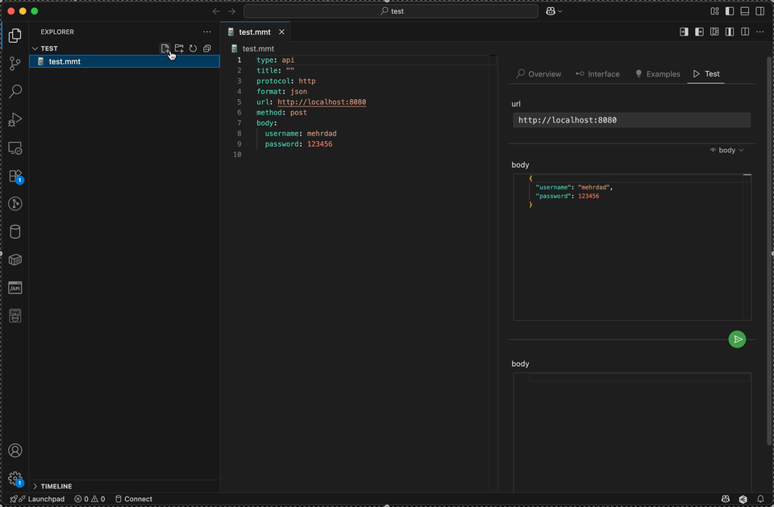

#  Multimeter

**Multimeter** is a powerful Visual Studio Code extension designed to write, run, and manage structured tests using `.mmt` files. It supports a wide range of test types — including API, integration, functional, and custom tests — all stored directly in your application's repository as version-controlled files.

## 🚀 Features

- 🧩 UI editor along with text editor + auto complete.
- 🧪 Supports all kinds of test logic, from simple checks to complex flows.
- 💾 Store test cases as files in your application git repo.
  - ⏳ Preserve tests' history in the git repo.
  - 🤖 Ability to generate tests using AI.
  - 📦 Having tests along with the changes in a same pull request.
- 🧱 JSON/XML schema-aware editing.
- 🗄 Environmet variable and presets support.
- ⛏️ Extract data from results using xpath, jsonpath and regular expression.
- 🌐 HTTP/WS protocols support.
- 🔄 Support Postman and OpenAPI collection convert.
- 🪞 Server mocking.

## 🎯 Next
- 🔗 Chaining request responses.
- ⛓️ Running tests in the pipeline.
- 📃 Auto documentation.
- 🏋 Load testing.

## 🛠️ Usage
- Add [Multimeter](https://marketplace.visualstudio.com/items?itemName=mshobeyri.multimeter) extention to your vscode.
- Create a .mmt file in your project (e.g., login.mmt).
- Follow the UI instructions 👌.

## ✍️ Example
### HTTP POST
Here is a simple example of a post request.
```yaml
type: api
protocol: http
url: http://localhost:8080
method: post
format: json
body: 
  username: mehrdad
  password: 123456
```

In the following gif, you can see the way of using this sample.

 

### Environment
Here I created an env varibale named url and used it in the previous example. This time I used UI to update yaml file. The url can has two value (localhost:8080 and google.com, labled as local and product), that helps to switch url easily. As you can see in the following gif, the url will be changed in the tests by changing it in environment panel.

 

**Special thanks to: Dear Ashkan Palganeh 👨🏻‍🦱.**