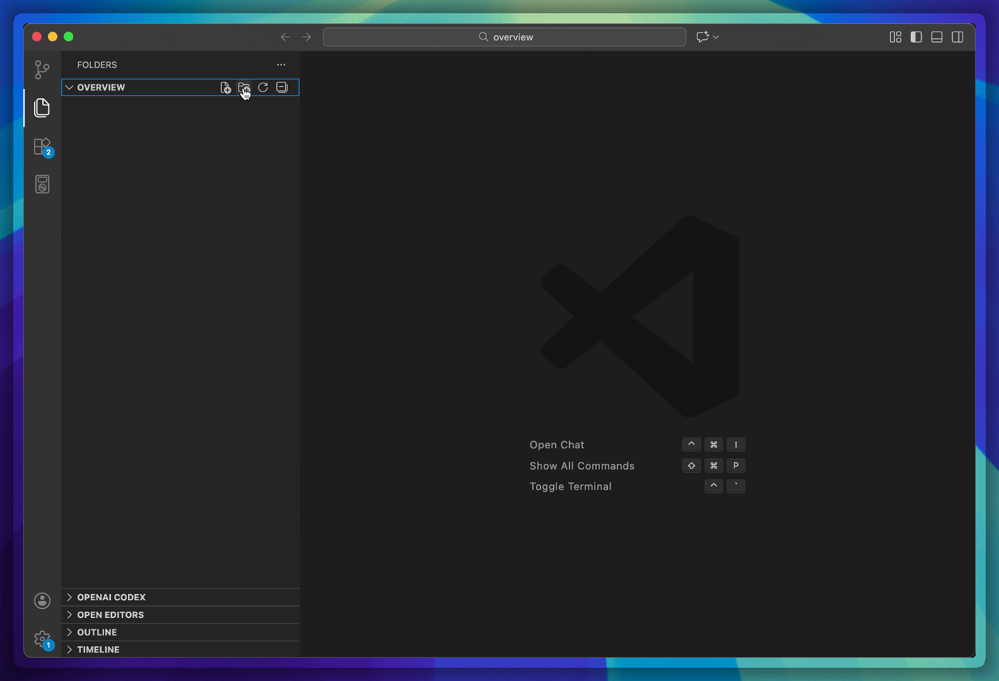

<div align="center">
  <a href="https://mmt.dev">
    
  </a>
  <h4>A Git-native system for defining, running, and versioning API test workflows.</h4>
  <p>
    <a href="https://marketplace.visualstudio.com/items?itemName=mshobeyri.multimeter">
      
    </a>
    <a href="https://marketplace.visualstudio.com/items?itemName=mshobeyri.multimeter">
      
    </a>
    <a href="https://github.com/mshobeyri/multimeter/blob/main/LICENSE.md">
      
    </a>
    <a href="https://github.com/mshobeyri/multimeter/stargazers">
      
    </a>
  </p>
  <p>
    <a href="https://mmt.dev/demos"> View Demo</a>
    &middot;
    <a href="https://mmt.dev"> Website</a>
    &middot;
    <a href="https://github.com/mshobeyri/multimeter/issues/new?labels=enhancement&template=feature-request.md"> Request Feature</a>
  </p>
</div>



---

## 🚀 Get Started in Seconds

1. Open VS Code
2. Search for **Multimeter** in the Extensions panel
3. Click **Install**

No account. No config. No CLI required.

**CI/CD?** 
`npm install -g mmt-testlight` 
runs the same `.mmt` files in any pipeline.

Or [Download CLI](https://mmt.dev/downloads) app for your platform. 


---

## 🚨 Problem

API testing is fragmented.

Teams are forced to split their workflow across multiple tools: one for manual exploration, another for CI automation, another for load testing, and separate systems for reporting.

This fragmentation creates a predictable outcome:

- Test logic gets duplicated across tools
- Manual and automated tests drift out of sync
- Ownership becomes unclear
- CI failures become harder to debug
- AI assistants can’t reason about hidden scripts, cloud-locked state, or fragmented definitions

**The root problem is simple: the test is not a file.**

It lives in cloud accounts, buried in scripts, or trapped in proprietary formats instead of your repository.

And if a test isn’t a plain, versioned, reviewable file, it can never become the single source of truth.

## 💡 Solution

One tool. One file format. Runs everywhere.

- Tests are plain YAML files stored in Git alongside your code
- The same `.mmt` file runs in VS Code UI, the `testlight` CLI, and CI pipelines
- Edit YAML and the UI updates instantly — edit the UI and YAML updates instantly
- Results are versioned, reproducible, and reviewable in pull requests
- Plain YAML is easy for AI to read, generate, and modify — fits naturally into AI-assisted workflows

## 🆚 Why Not Postman, Bruno, or Insomnia?

| | Postman | Bruno | Insomnia | **Multimeter** |
|---|---|---|---|---|
| **Price** | $19+/user/mo | $19+/user/mo | $16+/user/mo | **Free** |
| Git-native (plain files) | ❌ | ✅ | ❌ | ✅ |
| Offline & fully private | ⚠️ cloud sync | ✅ | ⚠️ cloud sync | ✅ |
| Same file runs in UI + CI | ❌ | ⚠️ partial | ❌ | ✅ |
| Code ↔ UI live sync | ❌ | ✅  | ❌ | ✅  |
| Test suites | ⚠️ collections | ⚠️ collections | ⚠️ collections | ✅ |
| Reusable tests (imports) | ⚠️ partial | ⚠️ partial | ⚠️ partial | ✅ |
| Load testing | ⚠️ paid add-on | ❌ | ❌ | ✅ |
| Drag & drop test builder | ❌ | ❌ | ❌ | ✅ |
| Built-in mock server | ❌ | ❌ | ❌ | ✅ |
| AI test generation | ❌ | ❌ | ❌ | ✅ |
| Flowchart test view | ❌ | ❌ | ❌ | ✅ |
| Auto-generated API docs | ❌ | ❌ | ❌ | ✅ |

[See full comparison →](https://mmt.dev/#comparison)

## ✨ Features

- **Real-time YAML ↔ UI sync** — no separation between "code" and "visual" modes
- **Git-native** — tests live in your repo, reviewed in PRs like any other file
- **Flowchart test view** — see branches, loops, and assertions as a diagram
- **Multi-protocol** — HTTP/REST, WebSocket, GraphQL, gRPC, SOAP
- **Built-in mock server** — spin up HTTP/WS mocks from YAML in milliseconds
- **AI test generation** — `@Multimeter` VS Code chat participant generates complete test flows from natural language, OpenAPI specs, or existing API definitions
- **Import from Postman, OpenAPI, .http, Bruno** — no rewrite needed
- **Multi-format reports** — HTML, JUnit XML, Markdown, MMT
- **Load testing (beta)** — threads, ramp-up, repeat limits
- **Drag & drop test builder** — build flows visually without scripting
- **Auto-generated API docs** — HTML and Markdown from the same YAML you already write
- **Fully offline & private** — nothing leaves your machine


[See all features →](https://mmt.dev/#features)

## 📦 Examples

### API Definition

This is the same file shown in the demo above — a simple POST request defined as a plain YAML file.

```yaml
type: api
url: https://test.mmt.dev/echo
method: post
body: |-
  {
    "name": "Multimeter",
    "message": "Hello from mmt!"
  }
```

### Test Flow

Chain multiple API calls with assertions. This test calls the same echo endpoint and verifies the response body.

```yaml
type: test
steps:
  - http: https://test.mmt.dev/echo
    method: post
    body: |-
      {
        "message": "Hi mmt!"
      }
    expect:
      body.body.message: Hi mmt!
```
[See all examples →](./examples)

---

**See Also:** 
[Demos](https://mmt.dev/demos) · [Documentation](./docs/toc.md) · [Website](https://mmt.dev) · [GitHub](https://github.com/mshobeyri/multimeter)
