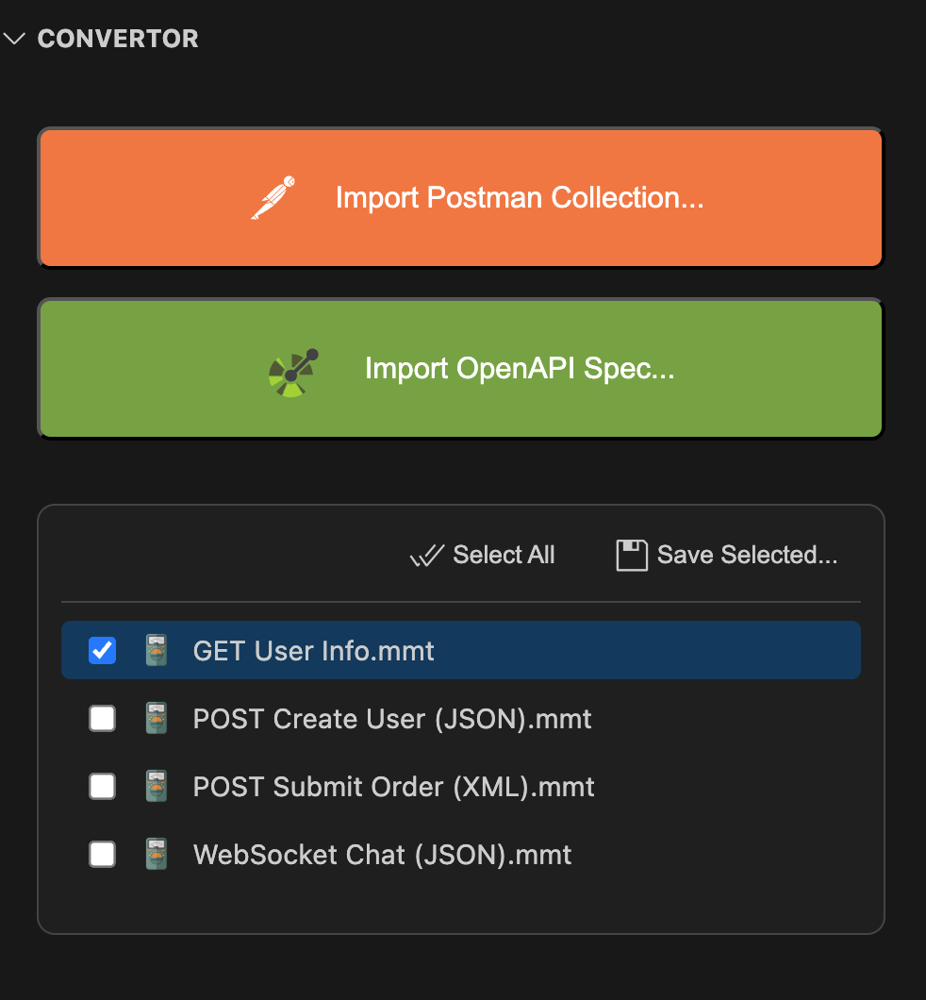

# Convertor

Turn external API definitions into MMT files you can edit, run, and test.

Use the Convertor panel to import an existing spec (for example, OpenAPI or Postman) and generate `.mmt` APIs that work across the Multimeter UI, CLI, and tests.

## What you can use it for
- Bootstrap a project from an existing API spec
- Quickly try endpoints in the UI without hand-writing all fields
- Create a consistent, typed starting point for tests
- Keep a read-only snapshot of a spec and iterate in MMT locally

## Supported sources
- OpenAPI: 3.x (typical JSON/YAML specs)
- Postman: Collections (v2)

The panel parses the spec and creates one or more `.mmt` API files (and optional examples) you can run immediately.

## How it works (at a glance)
1) Pick a source file (OpenAPI or Postman)
2) Choose a destination folder for generated files
3) Optionally filter endpoints or tags (when supported)
4) Generate: the panel writes `.mmt` API files you can open in the API editor

## Panel controls
- Source file: select a local OpenAPI or Postman file
- Output folder: where generated `.mmt` files will be written
- Filter by tag/path (when available): narrow the conversion scope
- Include examples when present: create example blocks on APIs
- Overwrite: allow replacing existing files (otherwise the converter skips collisions)

## What gets generated
- API `.mmt` files with:
  - protocol, method, url, headers, and body (inferred from the spec)
  - inputs mapped for common path/query parameters
  - example payloads when available
- A flat structure by default; you can rearrange files afterward

## Tips
- Map your base URL to an environment variable early (for example, API_URL) and reference it with `<<e:API_URL>>` so you can switch presets
- Review generated inputs/headers—tweak names to match your project conventions
- Use the API editor to refine bodies and add `setenv` for downstream tests

## Notes and limits
- Complex auth flows or vendor extensions may require manual touch-ups
- Some advanced schema features (oneOf/anyOf, polymorphism) may need simplification in generated bodies
- WebSocket endpoints are not exported from OpenAPI; add WS APIs manually in the API editor
