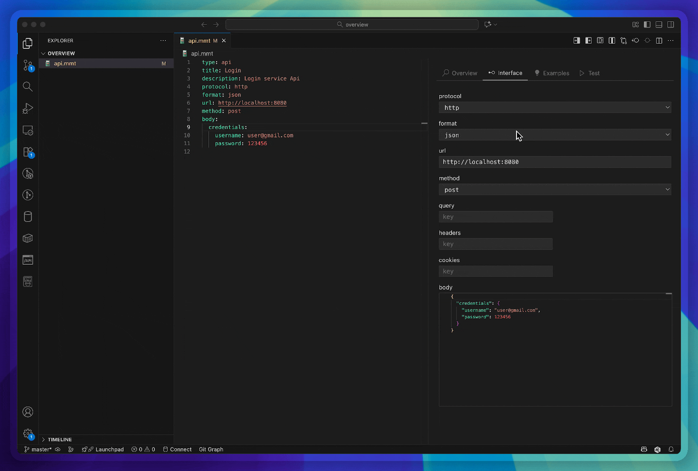

# Demos

This section showcases various features of Multimeter through animated demonstrations. Each demo highlights a specific capability of the tool.

## API Testing

Demonstrates API testing capabilities, including request configuration, method selection, headers, query parameters, and response handling. Shows how to send HTTP requests and inspect responses in the integrated tester.

See also: [API Testing Documentation](api-mmt.md)

## Documentation Generation

Shows how Multimeter generates documentation from MMT test files, converting them to HTML or Markdown formats for easy sharing and reference.

See also: [Documentation](doc-mmt.md)

## Environment Variables

Illustrates environment variable management, including defining variables, substitution in test configurations, and dynamic value injection.

See also: [Environment Variables](environment-mmt.md)

## Git Integration

Demonstrates Git integration features for version control of test files, including commit tracking and repository management within the Multimeter interface.

## Mock Server

Shows the mock server setup and usage, allowing simulation of API endpoints for testing without external dependencies.

See also: [Mock Server](mock-server.md)

## Postman Import

Illustrates importing Postman collections into Multimeter format, enabling migration of existing API tests and collections.

## UI Overview

Provides a general overview of the Multimeter editor interface, including the YAML editor, preview panels, and various tool integrations.

## WebSocket Testing

Demonstrates WebSocket testing capabilities, including connection establishment, message sending/receiving, and real-time communication handling.

## XML Handling

Shows XML body handling and formatting in API tests, including parsing, validation, and pretty-printing of XML payloads.

## AI Test Generation

Demonstrates using the Test Generation Reference to scaffold API and test files via AI assistance, converting descriptions or external specs (OpenAPI/Postman) into runnable `.mmt` artifacts.

See also: [Test Generation Reference](testgen-profile.md)