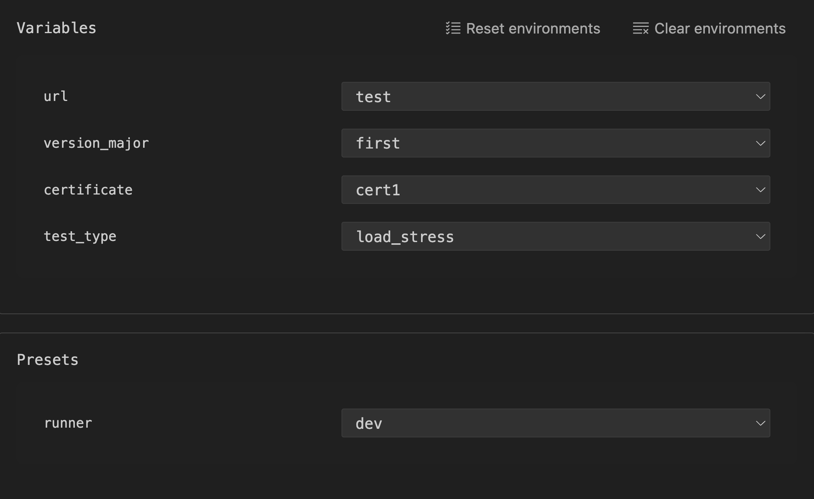
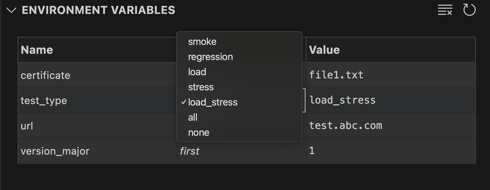

# Environment
Acts as a global store for variables to read and write across tests. Like any global scope, use it sparingly. Prefer it for shared configuration (for example: base URLs, modes, timeouts) rather than per-step data.


## Define an environment file
```yaml
type: env
variables:
  API_URL: "http://localhost:8080"
  USER: "alice"
  PASS: "secret"
  MODE:
    dev: "debug"      # map of named choices
    prod: "release"
  TIMEOUTS:
    - 1000            # list of allowed values (optional)
    - 2000
presets:
  runner:
    dev:
      API_URL: dev    # picks choice "dev" when the variable is defined as a mapping
      MODE: dev
    prod:
      API_URL: prod
      MODE: prod
```

Notes
- `variables` values can be:
  - scalar (string/number/bool/null)
  - object map (named choices)
  - array list of allowed values
- `presets` groups can be hierarchical; `runner.dev` is a common pattern
 
## Usage
Supported token forms in tests and APIs:
- `e:VAR`
- `<<e:VAR>>`

What to use when
- Use `e:VAR` when the value is just the variable by itself (a standalone YAML value). Types are preserved (numbers, booleans, strings).
- Use `<<e:VAR>>` to force substitution inside quoted/template strings in generated JS; it’s the safest choice when you’re unsure.

Note: `e:{VAR}` and `{{VAR}}` are not supported.

Example:
```yaml
url: <<e:API_URL>>/login
headers:
  Authorization: Bearer <<e:TOKEN>>
body:
  username: e:USER
  password: e:PASS
```

## Using presets and overrides in CLI
Use preset from env file:
```sh
 testlight run tests/login.mmt --env-file env.mmt --preset runner.dev
```

Override values explicitly (wins over preset):
```sh
 testlight run tests/login.mmt --env-file env.mmt --preset runner.dev \
  -e API_URL http://localhost:8080 -e USER bob
```
Without env file, pass env directly:
```sh
 testlight run tests/login.mmt -e API_URL=http://localhost:8080 -e USER=alice -e PASS='00123'
```

Typing rules for CLI values
- Unquoted numbers and booleans are coerced (e.g., `true`, `42`).
- Quoted numbers remain strings (e.g., `'00123'`).

## Edit environments in the UI
- You can modify variables and set presets using the UI panels.
- From the Environment panel, you can pick preset groups and values, then:
  - Click "Set To Workspace" to apply your changes to the Environment Variables workspace.
  - Click "Clear Workspace" to clear the Environment Variables from workspace.




- You can change variable selections and values directly in the Environment Variables panel. Choices (like url/test_type) are offered as dropdowns; plain values can be edited inline. Edits are saved back to your `.mmt` env file.



## Promote values to env during runs
In API definitions, use `setenv` to capture values from responses for later steps.
```yaml
setenv:
  TOKEN: body[token]
```

## Reference (types)
- type: `env`
- variables: record<string, string | object (choices) | array (allowed values)>
- presets: record<string, record<string, record<string, string|number|boolean|null>>>
