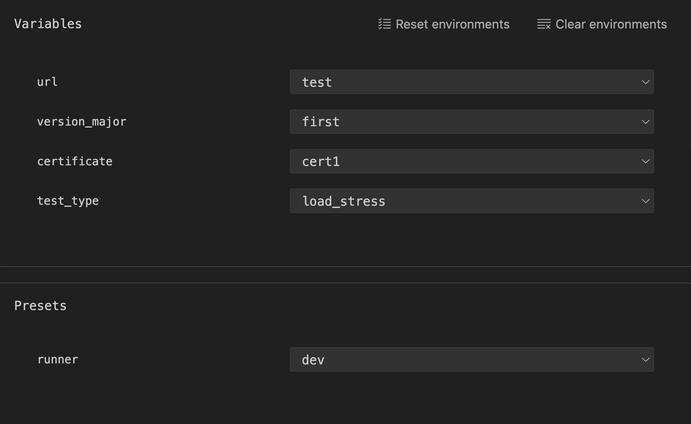
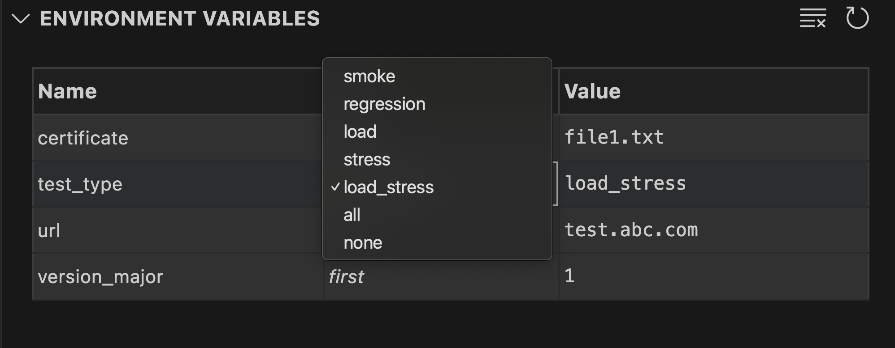

# Environment YAML Reference

Usage-first guide for environment `.mmt` files: variables, presets, and overrides.

Supported token forms in tests/APIs
- `e:VAR`
- `<e:VAR>`
- `<<e:VAR>>`

## Define an environment file
```yaml
 type: env
 variables:
   API_URL: "http://localhost:8080"
   USER: "alice"
   PASS: "secret"
   MODE:
     dev: "debug"      # map of named choices
     prod: "release"
   TIMEOUTS:
     - 1000            # list of allowed values (optional)
     - 2000
 presets:
   runner:
     dev:
       API_URL: dev    # picks variables.API_URL choice "dev" if mapping exists
       MODE: dev
     prod:
       API_URL: prod
       MODE: prod
```

Notes
- `variables` values can be:
  - scalar (string/number/bool/null)
  - object map (named choices)
  - array list of allowed values
- `presets` groups can be hierarchical; `runner.dev` is a common pattern

## Using presets and overrides (CLI)
```
# Use preset from env file
 testlight run tests/login.mmt --env-file env.mmt --preset runner.dev

# Override values explicitly (wins over preset)
 testlight run tests/login.mmt --env-file env.mmt --preset runner.dev \
  -e API_URL http://localhost:8080 -e USER bob

# Without env file, pass env directly
 testlight run tests/login.mmt -e API_URL=http://localhost:8080 -e USER=alice -e PASS='00123'
```

Typing rules for CLI values
- Unquoted numbers and booleans are coerced (e.g., `true`, `42`)
- Quoted numbers remain strings (`'00123'`)

## Referencing env in tests/APIs
```yaml
url: <e:API_URL>/login
headers:
  Authorization: Bearer <e:TOKEN>
body:
  username: e:USER
  password: e:PASS
```

## Edit environments in the UI
- You can modify variables and set presets using the UI panels.
- From the Environment panel, you can pick preset groups and values, then:
  - Click "Reset Environments" to apply your changes to the Environment Variables panel.
  - Click "Clear Environments" to clear the Environment Variables panel.



- You can change variable selections and values directly in the Environment Variables panel. Choices (like url/test_type) are offered as dropdowns; plain values can be edited inline. Edits are saved back to your `.mmt` env file.



## Promote values to env during runs
In API definitions, use `setenv` to capture values from responses for later steps.
```yaml
setenv:
  TOKEN: $.body.token
```

## Reference (types)
- type: `env`
- variables: record<string, string | object (choices) | array (allowed values)>
- presets: record<string, record<string, record<string, string|number|boolean|null>>>
