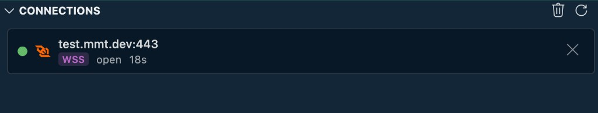

# Connections

Watch live HTTP keep-alive and WebSocket sessions from the Multimeter activity bar.

Use the **Connections** panel ({{btn:plug:Connections}}) to see what Multimeter has open right now — long-lived WebSocket sessions from the API tester, and HTTP/HTTPS keep-alive sockets reused across sends. Close individual connections or clear them all when you need a clean slate.

## What you can use it for

- Confirm a WebSocket **Connect** in the API tester is still open
- Spot idle or stuck keep-alive HTTP connections to a host
- Close a session without restarting VS Code or reloading the window
- See how long a connection has been open and when it was last active

## How it works

- Connections appear when Multimeter opens a live socket through the extension network bridge
- **WebSocket** — click **Connect** on a `protocol: ws` API in the [API tester](../files/api/index.md); the session stays open until you disconnect, close it here, or the server ends it
- **HTTP / HTTPS** — keep-alive sockets are tracked when the HTTP client reuses a connection across sends
- One-shot HTTP sends that do not keep a socket open may not appear (or only briefly)
- CLI and core-only runs do not populate this panel — it tracks live sessions in the VS Code extension

## Connection details

Each row shows:

| Element | What it shows |
|---|---|
| **Status dot** | Lifecycle state — see [Connection states](#connection-states) |
| **Protocol icon** | HTTP or WebSocket icon |
| **Host** | Hostname and port (e.g. `test.mmt.dev:443`) |
| **Protocol badge** | `HTTP`, `HTTPS`, `WS`, or `WSS` |
| **State** | Current lifecycle label (`open`, `idle`, …) |
| **Request count** | Number of requests or messages on that connection (when greater than zero) |
| **Duration** | Time since the connection opened — updates every second |
| **Last activity** | When state is **idle**, shows `last: … ago` since the last request or message |

Rows are sorted by most recent activity.

## Connection states

| State | Indicator | Meaning |
|---|---|---|
| **connecting** | Blue (pulsing) | Handshake in progress |
| **open** | Green | Active connection |
| **idle** | Orange | Open but no recent activity |
| **closing** | Red | Shutting down |

## Panel controls

Toolbar actions (top right of the view):

| Control | What it does |
|---|---|
| {{btn:refresh:Refresh Connections}} | Reload the connection list from the tracker |
| {{btn:trash:Close All Connections}} | Close every tracked connection |

Per connection:

| Control | What it does |
|---|---|
| {{btn:close:Close}} | Close that connection — WebSocket disconnect or destroy the keep-alive socket |

When no connections are active, the panel shows an empty state with a plug icon and **No active connections**.

## WebSocket vs HTTP

- **WebSocket (`WS` / `WSS`)** — appears when you click **Connect** on a WebSocket API in the tester. Live **Send** uses this open session; it is separate from one-shot test or CLI runs.
- **HTTP / HTTPS** — tracks keep-alive sockets reused by the HTTP client. Each send on the same socket increments the request count; sockets may move to **idle** between requests.

## Notes and limits

- The panel reflects the extension’s live network bridge only — not mock servers, CLI runs, or suite execution
- Closing a connection here does not change your API YAML or environment
- Very short-lived connections may appear and disappear quickly

---

## See also

- [WebSocket](../files/api/protocols/websocket.md) — Connect and live Send in the API tester
- [API](../files/api/index.md) — API tester and Connect button
- [HTTP](../files/api/protocols/http.md) — HTTP sends and keep-alive reuse
- [Getting Started](../quick-start.md) — sidebar panels overview
