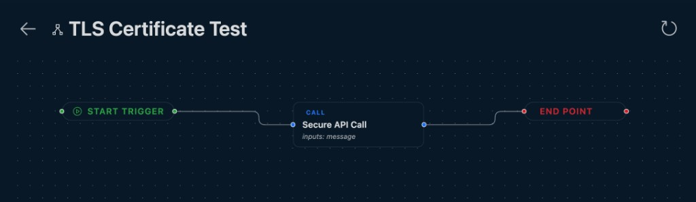

# Flow chart

Visualize a test or suite as a read-only flow diagram — steps, branches, loops, and parallel stages at a glance.

Use **Flow chart** when you want to understand execution order without stepping through YAML or the edit-mode Flow tab. The diagram is pan/zoom-able and stays inside the same panel as the runner (swipe in, **Back** to return).

## Where it is available

| File type | Top-bar control | What the diagram shows |
|-----------|-----------------|------------------------|
| `type: test` | {{btn:type-hierarchy-sub:Flow chart}} | Steps and stages in execution order — `call`, `http`, `assert`, `check`, control flow (`if`, `for`, `repeat`), delays, imports, and nested logic |
| `type: suite` | {{btn:type-hierarchy-sub:Flow chart}} | Suite item hierarchy grouped by execution stage — tests, APIs, nested suites, mock servers, and missing/cycle markers |
| `type: loadtest` | {{btn:type-hierarchy-sub:Flow chart}} | Read-only view of the **referenced test** hierarchy (same graph model as suite items for the underlying scenario) |

**Not available** for `type: api`, `type: server`, `type: env`, or `type: report` — those file types do not expose a Flow chart control.

On suite and load test files, **Flow chart** is disabled until the panel has at least one resolvable item (for example, after you configure a `test:` path on a load test).

## What you can use it for

- Review branching (`if` / `else`), loops, and parallel stages before a run
- See how suite items are grouped and which files they reference
- Share a quick mental model of a complex flow with teammates
- Jump to source: click a node to open the `.mmt` file it came from

## How it works

1. Open a test, suite, or load test file in VS Code (YAML on the left, runner panel on the right).
2. Click **Flow chart** in the panel top bar.
3. The panel swipes to a full-height diagram built from the parsed file (React Flow under the hood).
4. Use the canvas controls to pan, zoom, and fit the view.
5. Click **Back** (or the back control in the flow chart header) to return to the runner.

### Test flow charts

- One graph per test file: sequential steps, stage parallelism, and control-flow edges (true/false branches, loop-back).
- Step nodes use the same icons and titles as the test editor where possible.
- `call` steps show resolved API titles when available.

### Suite and load test flow charts

- Root node represents the suite or load test; child nodes mirror the item tree by execution stage.
- Referenced test files can expand into nested step boxes inside the graph.
- Missing files and circular references appear as dedicated node kinds (not executed).

### Flow chart header

| Control | What it does |
|---------|--------------|
| **Back** | Return to the runner panel |
| Refresh | Rebuild the graph from the latest YAML and re-fetch referenced test files |

The flow chart is **read-only**. To change steps or items, use **Edit Test**, **Edit Suite**, or **Edit Load Test** — or edit the YAML directly.

## Tips

- After editing YAML or referenced files, use **Refresh** if the diagram looks stale.
- For suite partial runs, the item tree Run buttons still target subtrees; the flow chart always reflects the full file structure.
- Pair with [Reports](../files/test/reports.md) after a run to connect the visual flow with pass/fail output.

## Notes and limits

- Click-to-open navigates to the **file**, not a specific YAML line.
- Very large suites may take a moment to lay out; nested test graphs are loaded on demand.
- No export to PNG/SVG yet — use the in-panel view for exploration.
- Run status is not overlaid on nodes during execution (runner and report panels show live results).

---

## See also

- [Test](../files/test/index.md) — Flow chart button on the test runner top bar
- [Suite](../files/suite/index.md) — hierarchy view of suite items
- [Load Test](../files/loadtest/index.md) — flow chart for the referenced test scenario
- [Edit Test](../files/test/edit.md) — edit-mode Flow tab is separate from Flow chart
- [Control flow](../files/test/steps/control-flow.md) — `if`, `for`, `repeat`, and `delay` in tests
- [Execution](../files/suite/execution.md) — parallel stages and partial runs in suites
