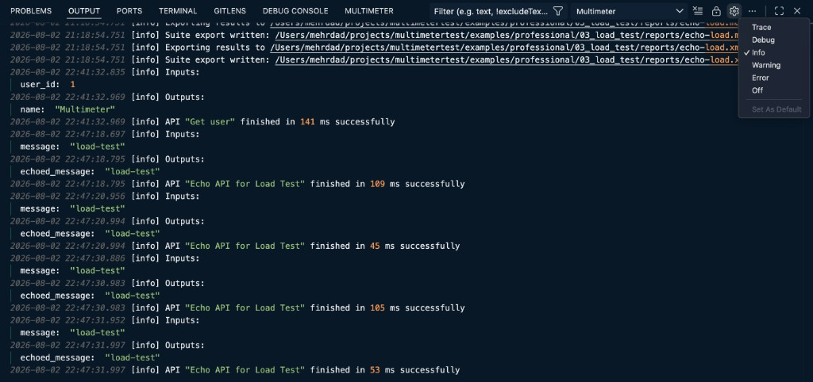

# Logging

Multimeter writes structured run logs to the VS Code **Output** panel when you run APIs, tests, or suites from the editor. Use it to inspect inputs and outputs, timings, suite exports, and failures without leaving VS Code.

## Where logs appear

Open **View → Output**, choose **Multimeter** from the channel dropdown, and scroll through the run log. When `multimeter.showLogOnRun` is enabled (default), the Output panel opens automatically on editor runs.

| Entry point | Destination |
|---|---|
| Editor (Send, Run test, Run suite) | Output panel → **Multimeter** channel |
| AI assistant (`@multimeter /run`) | Output panel → **Multimeter** channel |
| CLI (`testlight`) | Terminal stdout |

See [Where logs appear](../running/logging/where-logs-appear.md) for CLI options such as `--quiet` and `--log-level`.

## Log levels

The Output panel includes a built-in level filter (gear icon in the panel header). Available levels:

| Filter | Shows |
|---|---|
| **Trace** | Lowest detail — network request/response summaries during test runs |
| **Debug** | Request/response for API runs, environment variables, imported check passes |
| **Info** | Inputs, outputs, run lifecycle messages, direct-run check passes (default) |
| **Warning** | Non-fatal issues (e.g. example not found) |
| **Error** | Check/assert failures, runtime exceptions |
| **Off** | Hide all Multimeter log output |

Multimeter maps its internal levels (`trace`, `debug`, `info`, `warn`, `error`) to these Output panel levels. A run is marked **failed** if any `error`-level message is logged.

For a full breakdown of what each level includes, see [Log levels](../running/logging/log-levels.md).

## What gets logged

Logs are append-only and grouped by run. Typical content:

- **API runs** — `Inputs` and `Outputs` sections, finish message with duration (e.g. `API "Get user" finished in 141 ms successfully`); full request/response at `debug`
- **Test runs** — check/assert results, `print` output, network details at `trace` when using `call` steps
- **Suite runs** — per-item start/finish, aggregated child logs, cancellation warnings
- **Suite exports** — paths where report files were written (e.g. JUnit XML)

Timestamps and level tags prefix each line (`[info]`, `[debug]`, etc.).

## Tips

- Start at **Info** for everyday runs; switch to **Debug** or **Trace** when you need request/response bodies or network details
- Use **Error** to focus on failures during large suite runs
- The webview **Log** tab inside the test Report panel shows step-level check output during a run; the Output panel keeps the full, persistent log — see [Test logging](../running/logging/test-logging.md)

---

## See also

- [Logging (Running & CI/CD)](../running/logging/index.md) — deep dive: API, test, and suite logging policies
- [API logging](../running/logging/api-logging.md) · [Test logging](../running/logging/test-logging.md) · [Suite logging](../running/logging/suite-logging.md)
- [Testlight CLI](../running/testlight/index.md) — `--log-level` and `--quiet` for terminal runs
- [History](./history.md) — recent requests and responses in the bottom panel (separate from run logs)
