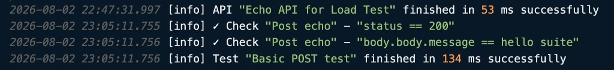

# Testlight CLI

Run Multimeter APIs, tests, suites, load tests, and documentation from the command line and in CI/CD.

Testlight compiles your `.mmt`/YAML tests to JS on the fly and executes them with the same core engine the VS Code extension uses.

