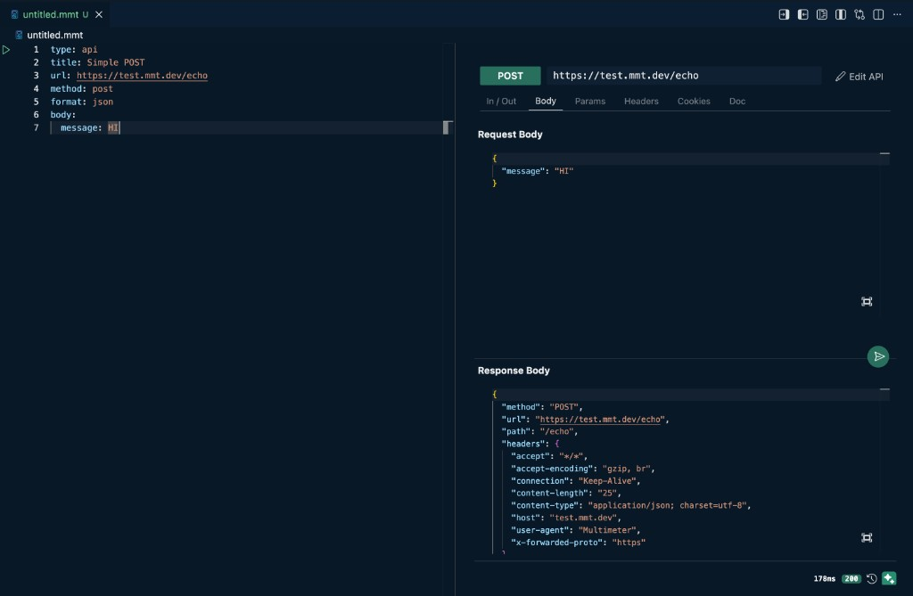

# MMT Files

Multimeter projects are folders of YAML `.mmt` files. The top-level `type` field decides how a file behaves. Most runs share [Environment](./files/env/index.md) variables (`<<e:>>` tokens) and can produce [Report](./files/report/index.md) output after completion.

## File types

| | Type | Purpose | Guide |
|---|---|---|---|
| $(symbol-method) | `api` | Single HTTP / WebSocket / GraphQL / gRPC request | [API](./files/api/index.md) |
| $(beaker) | `test` | Executable flow with steps and assertions | [Test](./files/test/index.md) |
| $(server-environment) | `env` | Variables, presets, certificates | [Environment](./files/env/index.md) |
| $(layers) | `suite` | Group and run tests or other suites | [Suite](./files/suite/index.md) |
| $(book) | `doc` | Generate API documentation | [Doc](./files/doc/index.md) |
| $(server) | `server` | Mock server endpoints | [Mock Server](./files/server/index.md) |
| $(dashboard) | `loadtest` | Concurrency / ramp-up load scenario (beta) | [Load Test](./files/loadtest/index.md) |
| $(file-text) | `report` | Structured results (usually generated) | [Report](./files/report/index.md) |

## Shared metadata

Most authored file types share the same documentation fields:

| Field | Purpose |
|---|---|
| `title` | Display name in the UI, docs, and reports |
| `description` | Longer explanation (Markdown supported on APIs) |
| `tags` | Labels for search and filtering |

They appear on **API**, **Test**, **Suite**, **Load Test**, and **Mock Server** files.

**Doc** files use `title` and `description` (no `tags`). **Environment** and **Report** files do not use this trio.

```yaml
type: api   # or test | suite | loadtest | server
title: Login
description: Authenticate and return a token
tags:
  - smoke
  - auth
```

## YAML and UI

Every `.mmt` file opens as a **split editor**:

- **Left** — YAML. This is the file on disk. Commit it, review it in pull requests, and run it from the CLI.
- **Right** — a UI for that file type: API tester, test runner, environment editor, and so on.



The **YAML** on the left is the file. The **Edit** page on the right writes to that YAML. The normal tester / runner UI is **temporary**: Send and Run use it, but it is not in the file until you **Save to YAML**.

Click {{btn:edit:Edit}} on the right to switch that pane into **edit mode** (forms and tabs instead of the run / preview view). Use the back control on the edit header to return.

You can always edit the YAML directly. If the tester already has unsaved UI edits, you are asked whether to discard them — see [API](./files/api/index.md#unsaved-changes).

If the YAML has errors, the right pane keeps the last valid UI and shows a red {{btn:error:YAML ERROR}} button (same layout as unsaved changes). Open it to read the error, click a line to jump there, or **Restore YAML** to revert to the last valid version.

### Show YAML, UI, or both

The editor title bar (top right of the `.mmt` tab) has three layout buttons:

| Control | What it does |
|---|---|
| {{btn:layout-sidebar-left:Hide YAML}} | Show only the UI pane |
| {{btn:layout-sidebar-right:Hide UI}} | Show only the YAML pane |
| {{btn:layout-centered:Show both}} | Show YAML and UI side by side |

The default is both. Change that with `multimeter.editor.defaultPanel` (`yaml-ui`, `yaml`, or `ui`).

## Next steps

- [Getting Started](./quick-start.md)
- [Start with a task](./tasks/index.md)
- [Browse examples](/docs/examples)
