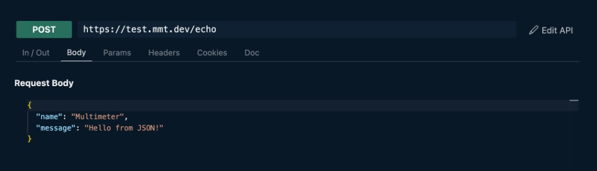
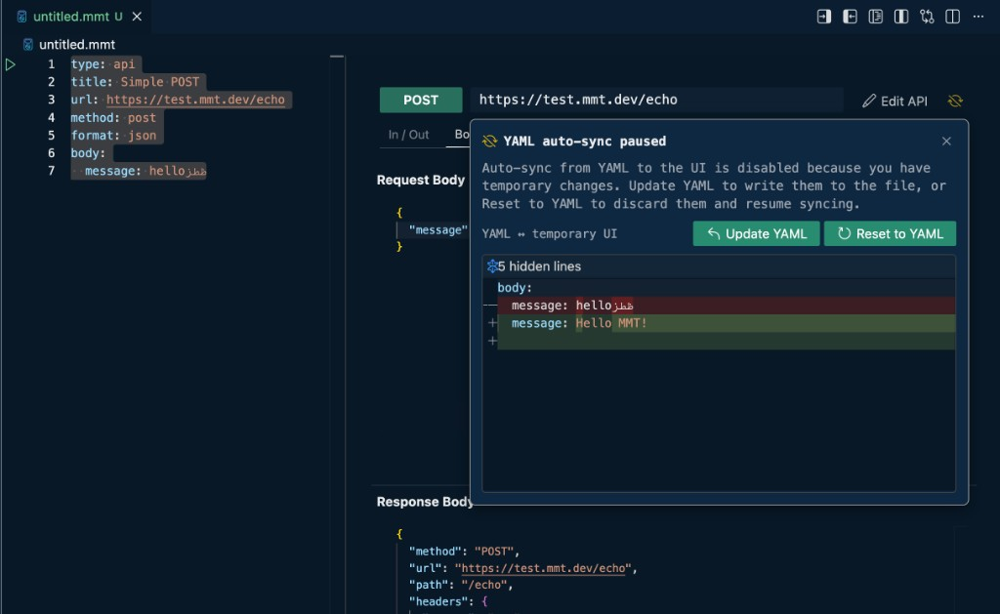

# API

Write request definitions in `.mmt` files with `type: api`. Open an API file in VS Code to get the **API tester** on the right (YAML stays on the left).



## YAML editor

Run glyphs appear in the left margin of the YAML pane:

| Control | What it does |
|---|---|
| {{btn:run}} on `type:` | Run the API with default inputs through core (opens log output) |
| {{btn:run}} on a named example's `name:` line | Run that example through core (opens log output) |

Example run glyphs appear only when the example has a non-empty `name`.

## API tester UI

### Top bar

| Control | What it does |
|---|---|
| **Method / protocol** | Colored dropdown left of the URL (e.g. {{btn:method:POST}}). Pick an HTTP method, or switch protocol to WebSocket / GraphQL / gRPC |
| **URL** | Editable request URL. Edits in the Params tab stay synced with the query string |
| {{btn:edit:Edit API}} | Switches to **edit mode** — see [Edit API](./edit.md). Hidden while the tester has unsaved changes |
| {{btn:warning:UNSAVED CHANGES}} | Appears instead of Edit API when the tester has unsaved UI edits — see [Unsaved Changes](#unsaved-changes) |

### Unsaved Changes

The API tester is **temporary**. Edits to method, URL, body, headers, and so on are used for Send, but they are not in the YAML until you save them there. Closing the file discards them. **Edit API** writes the YAML; the tester does not.

When the tester has unsaved edits, a bar at the top of the right pane turns yellow and **Edit API** is replaced by {{btn:warning:UNSAVED CHANGES}}. Open it to compare the two versions:

- {{btn:save:Save to YAML}} — write the tester values into the YAML
- {{btn:discard:Discard}} — throw away the UI changes and follow the YAML again

If you edit the YAML while the tester has unsaved changes, a dialog titled **Unsaved changes in UI** asks you to **Discard UI changes** (apply the YAML). Dismiss the dialog to keep the tester as-is.



### YAML errors

When the YAML on the left has errors, the tester keeps the last valid UI. The same top bar turns red and **Edit API** is replaced by {{btn:error:YAML ERROR}}. Open it to read the errors. Click an error to jump to that line. If the YAML is broken, **Restore YAML** reverts it to the last valid version.

### Tabs

Under the URL bar:

| Tab | What you see |
|---|---|
| **In / Out** | **Example** dropdown (**Defaults** or a named example), runtime **inputs** (range pickers from description annotations), and extracted **outputs** after a send |
| **Body** | Request body; after send, **Response Body** appears below Send. Right-click a field or click {{btn:sign-out}} to add it to `outputs:` — see [Outputs](./outputs.md) |
| **Params** | Query parameters |
| **Headers** | Request headers; response headers appear below Send after a reply |
| **Cookies** | Request cookies; response cookies appear below Send after a reply |
| **Doc** | Preview of `description` and `<<i:>>` / `<<o:>>` parameter docs |
| **GraphQL** / **gRPC** | Only when that protocol is selected (Body / Params / Cookies are hidden then) |

### Send

Below the request editors:

| Control | What it does |
|---|---|
| {{btn:send:Send}} | Circular send button — runs the current request (HTTP / GraphQL / gRPC). After ~1.5s while in flight it turns into **Cancel** |
| Right-click Send | Context menu: **Run in Core**, and **Run in Curl** for HTTP ([Curl](../../integration/curl.md)) |
| {{btn:plug:Connect}} | WebSocket only — connect first; Send stays disabled until connected |

### Bottom toolbar

Fixed bar at the bottom of the tester:

| Control | What it does |
|---|---|
| **Duration** | Last response time |
| **Status** | HTTP status or protocol error / warning |
| {{btn:history}} | Opens the **History** panel |
| {{btn:sparkle-filled}} | Toggle auto-format (beautify) for bodies |

See also: [History](../../panels/history.md) · [Connections](../../panels/connections.md)

## Supported

- Protocols: [HTTP](./protocols/http.md), [WebSocket](./protocols/websocket.md), [GraphQL](./protocols/graphql.md), [gRPC](./protocols/grpc.md)
- Formats: `json`, `xml`, `xmle`, `text`, `urlencoded`, `binary`
- Methods: `get`, `post`, `put`, `delete`, `patch`, `head`, `options`, `trace`

## Request

- `protocol:` `http` or `ws` (optional — inferred from URL if not specified)
  - URLs starting with `ws://` or `wss://` default to `ws`
  - All other URLs default to `http`
- `url:` server URL
- `method:` HTTP method `get`, `post`, `put`, `delete`, `patch`, `head`, `options`, `trace`
- `timeout:` per-request timeout in milliseconds (optional; overrides the default network timeout)
- `headers:` HTTP headers
- `query:` query parameters for HTTP requests
- `cookies:` HTTP cookies

`body` and `format`: [Body](./body/index.md) — [format](./body/format.md), [request body](./body/body.md), [HTTP body examples](./protocols/http-bodies.md).

Sample:

```yaml
protocol: http
url: x.com/blog
method: get
timeout: 5000
headers:
  Authorization: Bearer <<e:token>>
  Accept: application/json
query:
  limit: "20"
  page: "1"
  # will be converted to x.com/blog?limit=20&page=1
cookies:
  session: e:session_id
```

## API elements

- [Quick start](./quick-start.md) · [Edit API](./edit.md)
- [Protocols](./protocols/index.md) — HTTP, WebSocket, GraphQL, gRPC
- [Body](./body/index.md) — [format](./body/format.md), [request body](./body/body.md), [HTTP examples](./protocols/http-bodies.md)
- [Headers](./headers.md) · [Auth](./auth.md)
- [Inputs](./inputs.md) · [Outputs](./outputs.md)
- [Documentation](./documentation.md) — `title`, `tags`, `description`, `<<i:>>` / `<<o:>>` annotations
- [setenv](./setenv.md) · [Examples](./examples.md) · [Dynamic values](../../features/dynamic-values.md)
- [Complete examples](./complete-examples.md) · [CLI](./cli.md) · [Reference](./reference.md)
