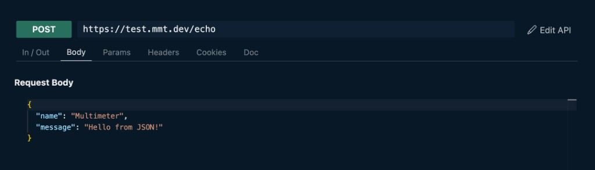

# API

Write request definitions in `.mmt` files with `type: api`. Open an API file in VS Code to get the **API tester** on the right (YAML stays on the left).



## YAML editor

Run glyphs appear in the left margin of the YAML pane:

| Control | What it does |
|---|---|
| {{btn:run}} on `type:` | Run the API with default inputs through core (opens log output) |
| {{btn:run}} on an example's `id:` line | Run that example through core (opens log output) |

Example run glyphs appear only when the example has a non-empty `id` (or deprecated `name`).

## API tester UI

### Top bar

| Control | What it does |
|---|---|
| **Method / protocol** | Colored dropdown left of the URL (e.g. {{btn:method:POST}}). Pick an HTTP method, or switch protocol to WebSocket / GraphQL / gRPC |
| **URL** | Editable request URL. Edits in the Params tab stay synced with the query string |

Edits in the tester (including Doc pencils, Settings, and In/Out declarations) write to the YAML. See [Edit API fields](./edit.md).

### YAML errors

When the YAML on the left has errors, the tester keeps the last valid UI. The top bar shows {{btn:error:YAML ERROR}}. Open it to read the errors. Click an error to jump to that line. If the YAML is broken, **Restore YAML** reverts it to the last valid version.

### Tabs

**Request** and **Response** each have their own tabs. By default they stack (request above response). Use the split toggle on the response toolbar to switch to side-by-side. Drag the sash between them to resize.

| Request tab | What you see |
|---|---|
| {{btn:settings-gear}} | `timeout`, `import` |
| **Auth** | `auth` (none, bearer, basic, API key, OAuth2) |
| **Params** | Query parameters |
| **Headers** | Request headers |
| **Body** | Request body (format bar, pretty/raw). Telescope toggles resolved values vs editable tokens — see below |
| **Cookies** | Request cookies |
| **Inputs** | **Example** dropdown (**Select...** or `id - title`) + **+**; declared/runtime **Inputs** and soft **Expect**. Pencil edits declarations. Badge shows input count |
| **Doc** | **Title**, **tags**, and **description** (Markdown). Pencil per section to edit |
| **GraphQL** / **gRPC** | Only when that protocol is selected (Body / Params / Cookies are hidden then) |

| Response tab | What you see |
|---|---|
| **Body** | Response body (pretty / raw / preview, including images). {{btn:sign-out}} extracts the value under the cursor into `outputs:` |
| **Headers** | Response headers. {{btn:sign-out}} on a value adds that header to `outputs:` |
| **Cookies** | Response cookies. {{btn:sign-out}} on a value adds that cookie to `outputs:` |
| **Outputs** | Extracted **Outputs** and **Setenv** values after Send. Pencil edits extraction / setenv expressions. Badge shows outputs + setenv count |

Send sits on the URL row (next to the method+URL control). Duration, status, history, clear-response, and the request/response layout toggle sit at the right of the response tab bar. See [Outputs](./outputs.md).

### Request toolbar

| Control | What it does |
|---|---|
| {{btn:telescope}} | Toggle **token mirror**: show resolved input/env values, or editable `{{…}}` / token text in request fields (including Body) |
| {{btn:globe}} | Open the [Environment Variables](../env/ui.md) panel |

### Send

| Control | What it does |
|---|---|
| {{btn:send:Send}} | Circular send button beside the URL — runs the current request (HTTP / GraphQL / gRPC). After ~1.5s while in flight it turns into **Cancel**. Shortcut: **⌘Enter** (macOS) / **Ctrl+Enter** |
| **More** (chevron next to Send) | **Run in Core**, and **Run in Curl** for HTTP ([Curl](../../integration/curl.md)) |
| {{btn:plug:Connect}} | WebSocket only — connect first; Send stays disabled until connected |

While a request is in flight, the status-bar badge opens the file on click for a normal Send; **Run in Core** uses the status-bar menu for **Stop** or **Open file**. Closing the tab during a UI send prompts to save — see [Panels — Status bar](../../panels/index.md#status-bar).

See also: [History](../../panels/history.md) · [Connections](../../panels/connections.md)

## Supported

- Protocols: [HTTP](./protocols/http.md), [WebSocket](./protocols/websocket.md), [GraphQL](./protocols/graphql.md), [gRPC](./protocols/grpc.md)
- Formats: `none`, `json`, `xml`, `xmle`, `text`, `html`, `urlencoded`, `binary`, `multipart`
- Methods: `get`, `post`, `put`, `delete`, `patch`, `head`, `options`, `trace`

## Request

- `protocol:` `http` or `ws` (optional — inferred from URL if not specified)
  - URLs starting with `ws://` or `wss://` default to `ws`
  - All other URLs default to `http`
- `url:` server URL
- `method:` HTTP method `get`, `post`, `put`, `delete`, `patch`, `head`, `options`, `trace` (optional — defaults to `post` when `body` is set, otherwise `get`)
- `timeout:` per-request timeout in milliseconds (optional; overrides the default network timeout)
- `headers:` HTTP headers
- `query:` query parameters for HTTP requests
- `cookies:` HTTP cookies

`body` and `format`: [Body](./body/index.md) — [format](./body/format.md), [request body](./body/body.md), [HTTP body examples](./protocols/http-bodies.md).

Sample:

```yaml
protocol: http
url: x.com/blog
method: get
timeout: 5000
headers:
  Authorization: Bearer <<e:token>>
  Accept: application/json
query:
  limit: "20"
  page: "1"
  # will be converted to x.com/blog?limit=20&page=1
cookies:
  session: e:session_id
```

## API elements

- [Quick start](./quick-start.md) · [Edit API fields](./edit.md)
- [Protocols](./protocols/index.md) — HTTP, WebSocket, GraphQL, gRPC
- [Body](./body/index.md) — [format](./body/format.md), [request body](./body/body.md), [HTTP examples](./protocols/http-bodies.md)
- [Headers](./headers.md) · [Auth](./auth.md)
- [Inputs](./inputs.md) · [Outputs](./outputs.md)
- [Documentation](./documentation.md) — `title`, `tags`, `description`, `<<i:>>` / `<<o:>>` annotations
- [setenv](./setenv.md) · [Examples](./examples.md) · [Dynamic values](../../features/dynamic-values/index.md)
- [Complete examples](./complete-examples.md) · [CLI](./cli.md) · [Reference](./reference.md)
