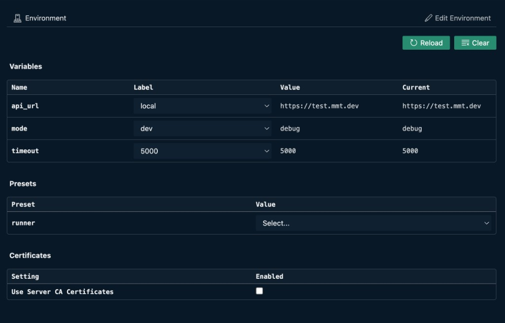

# Environment

Acts as a global store for variables to read and write across tests. Like any global scope, use it sparingly. Prefer it for shared configuration (for example: base URLs, modes, timeouts) rather than per-step data.

Open a `type: env` file in VS Code to get the **environment panel** on the right (YAML stays on the left). Click {{btn:edit:Edit Environment}} to edit variables, presets, settings, and certificates — see [Edit Environment](./edit.md).

Use {{btn:refresh:Reload}} to rebuild workspace variables from the open env file (applies current preset selections). Use {{btn:clear-all:Clear}} to remove all workspace environment variables and preset selections. The same runtime values are also available in the [Environment variables panel](./ui.md) in the Multimeter bottom panel.



## Define an environment file
```yaml
type: env
variables:
  api_url:
    local: "http://localhost:8080"      # key-value map (named choices)
    staging: "https://staging.example.com"
    prod: "https://test.mmt.dev"
  mode:
    dev: "debug"
    prod: "release"
  timeouts:
    - 1000                               # array list (allowed values)
    - 2000
    - 5000
presets:
  runner:
    dev:
      api_url: local    # picks choice "local" from the variable map
      mode: dev
    prod:
      api_url: prod
      mode: prod
setting:
  http:
    version: "auto"
    timeout: 30000
```

Notes
- `variables` values must be one of:
  - **key-value map** (named choices) — a preset selects a choice by key
  - **array list** (allowed values) — a preset or user picks from the list
- `presets` groups can be hierarchical; `runner.dev` is a common pattern
 
## Usage
Supported token forms in tests and APIs:

| Syntax | Where to use | Type behavior |
|--------|-------------|---------------|
| `<<e:VAR>>` | Anywhere in a string (URLs, headers, body text) | Always substituted as string |
| `e:VAR` | As the entire value after `: ` (colon + space) | Preserves type (number, boolean, string) |

What to use when
- Use `<<e:VAR>>` when you want substitution anywhere in a string (inside URLs, headers, or other text).
- Use `e:VAR` only when it appears as the entire value after `: `; types are preserved (numbers, booleans, strings).
- You can append **accessors** to either form when you need only part of the value:
  - `<<e:token[0]>>` — first character / item
  - `<<e:token[0:6]>>` — string or array slice (end-exclusive)
  - `<<e:user.name>>` — property access

Notes
- `e:VAR` is not replaced inside plain text like `hi:e:VAR there`; it must follow `: `.
- `{{VAR}}` is not supported — use `<<e:VAR>>` or `e:VAR` instead.
- Slice form `[start:end]` uses normal JS `slice(start, end)` semantics.

Examples:
```yaml
url: <<e:api_url>>/login
headers:
  Authorization: Bearer <<e:token>>
  X-Token-Prefix: <<e:token[0:6]>>
body:
  username: e:user
  password: e:pass
  first_letter: <<e:user[0]>>
```


Next: [Environment variables panel](./ui.md) · [Edit Environment](./edit.md) · [CLI](./cli.md) · [Settings](./settings.md) · [Project root](./project-root.md) · [Reference](./reference.md)
