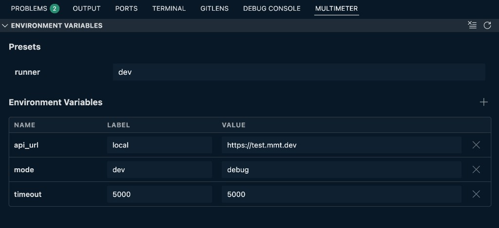

# Environment variables panel

Open the **Multimeter** bottom panel and choose **Environment Variables** ({{btn:server-environment:Environment Variables}}). This panel holds workspace runtime variables and presets used by API runs, tests, and suites.

Toolbar actions (top right of the view):

| Control | What it does |
|---|---|
| {{btn:refresh:Reload}} | Re-read workspace environment variables and presets from storage |
| {{btn:clear-all:Clear}} | Clear all workspace environment variables and presets (confirmation required) |

## Presets

When an environment file defines preset groups, they appear under **Presets**. Each row is a group name (for example `runner`) with a dropdown to pick a named option (for example `dev` or `prod`). Changing a preset applies that group's variable bindings.

## Variables table

| Column | What it shows |
|---|---|
| **Name** | Variable name — referenced as `e:NAME` or `<<e:NAME>>` in tests and APIs |
| **Label** | Selected choice from the env file definition (dropdown when the variable has choices) |
| **Value** | Resolved runtime value — edit inline when the variable allows it |

Click {{btn:add}} next to **Environment Variables** to add a new row. Enter a name and value, then confirm with **Add** (or cancel). Manual rows are stored in workspace runtime only — they are not written to the `.mmt` file. Use {{btn:close}} on a row to delete that variable from the workspace.

To change variable definitions, preset groups, HTTP settings, or certificates in the `.mmt` file, see [Edit Environment](./edit.md).

---

See also: [Environment overview](./index.md) · [CLI](./cli.md) · [Project root](./project-root.md) · [Reference](./reference.md)
