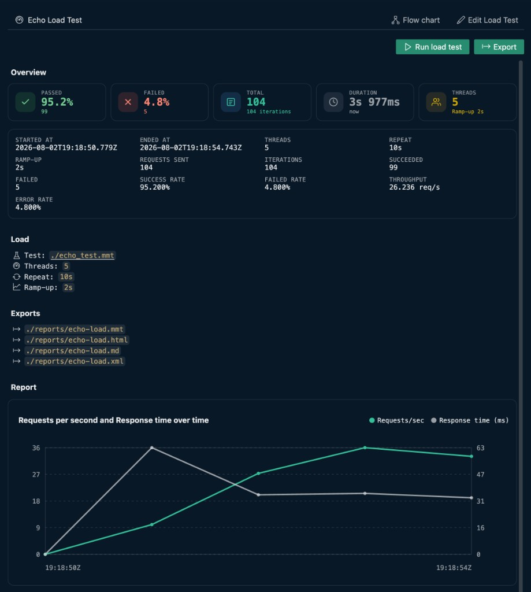

# Load Test

Use `type: loadtest` to define a load test MMT file. A load test runs one `type: test` file repeatedly with concurrency, ramp-up, duration or iteration limits, and load-oriented reporting.

Open a load test file in VS Code to get the **load test panel** on the right (YAML stays on the left). Click {{btn:edit:Edit Load Test}} to configure the test path, load settings, environment, and exports — see [Edit Load Test](./edit.md).



> **Beta:** Load testing is supported in beta. The file shape and report schema are stable enough for local and CI use, but distributed load execution and deeper threshold controls may still evolve.

## Load test panel UI

### Top bar

| Control | What it does |
|---|---|
| `title` | Load test title from `title:` (shown with the dashboard icon) |
| {{btn:type-hierarchy-sub:Flow chart}} | Opens a read-only view of the underlying test hierarchy |
| {{btn:edit:Edit Load Test}} | Switches to **edit mode** — see [Edit Load Test](./edit.md) |

See also: [Flow chart](../../features/flow-chart.md)

### Run bar

| Control | What it does |
|---|---|
| {{btn:play:Run load test}} / **Stop load test** | Start or stop the load run |
| Right-click Run load test | Context menu: **Run in Core** |
| {{btn:export:Export}} | Export the load report (HTML, Markdown, MMT, or JUnit XML). Disabled until a run completes |

### Before and after a run

| Section | What you see |
|---|---|
| **Load** | Referenced `test:` path plus `threads`, `repeat`, and `rampup` — see [Load config](./load-config.md) |
| **Environment** | Preset, env file, and inline variables when `environment:` is configured — see [Environment](./environment.md) |
| **Exports** | Report export paths from `export:` — see [Exports](./exports.md) |
| **Overview** | Live and final load metrics (requests, failures, success rate, throughput, latency) — see [Reports](./reports.md) |

During a run, the panel updates load metrics in real time. After completion, use {{btn:export:Export}} or the `export:` field to save MMT, HTML, Markdown, or JUnit XML reports.

## Supported

- One `type: test` scenario under load — see [Load config — test](./load-config.md#test)
- Concurrency, duration, and ramp-up — see [Load config](./load-config.md)
- Top-level `import:` for JSON/YAML/CSV data — see [Data Imports](../../integration/data-imports.md)
- Environment presets and overrides — see [Environment](./environment.md)
- Auto-export after completion — see [Exports](./exports.md)
- CLI runs with `testlight run` — see [CLI](./cli.md)

Sample:

```yaml
type: loadtest
title: Login Load Test
description: Run the login flow with 100 virtual users for one minute.
tags:
  - load
  - auth
environment:
  preset: perf
threads: 100
repeat: 1m
rampup: 10s
export:
  - ./reports/login-load.mmt
  - ./reports/login-load.html
test: ./tests/login.mmt
```

## Load test elements

- [Quick start](./quick-start.md) · [Edit Load Test](./edit.md) · [Reports](./reports.md) · [Report overview](../report/index.md) · [CLI](./cli.md) · [Reference](./reference.md)
- [Load config](./load-config.md) · [Environment](./environment.md) · [Exports](./exports.md)
