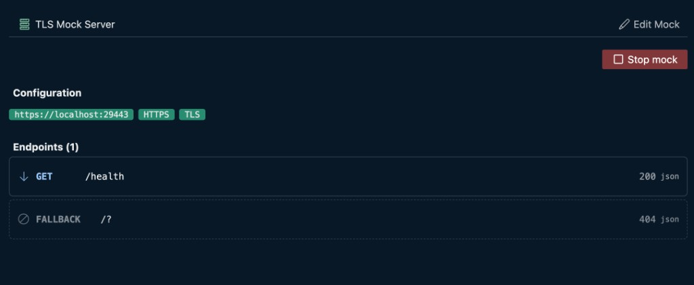

# Mock Server

Use `type: server` to define mock server endpoints in YAML. Open a server file in VS Code to get the **mock runner** on the right (YAML stays on the left). Click {{btn:edit:Edit Mock}} to edit endpoints and settings — see [Edit Mock](./edit.md).



For the lightweight **Mock Server** sidebar panel (reflect mode, quick prototyping), see [Mock server panel](./panel.md).

## Mock runner UI

### Top bar

| Control | What it does |
|---|---|
| `title` | Server title from `title:` (shown with the server icon) |
| {{btn:edit:Edit Mock}} | Switches to **edit mode** — see [Edit Mock](./edit.md) |

### Run bar

| Control | What it does |
|---|---|
| {{btn:play:Run mock}} | Starts the mock from this editor. While running, turns into **Stop mock** |
| **More** (chevron next to Run) | **Run in mock server panel** — opens the sidebar Mock Server panel, binds this file, and starts there |
| Server icon | Turns green while the mock is running |

**Run mock** (UI) marks the tab dirty so closing it prompts Save / Don't Save / Cancel. Closing the tab stops that UI-started server. **Run in mock server panel** does not dirty the editor — you can close the file while the server keeps running. Stop panel-started mocks from the [Mock Server sidebar](./panel.md) (or its status-bar menu: open panel / open file). See [Panels — Status bar](../../panels/index.md#status-bar).

### Run view

| Section | What you see |
|---|---|
| **Configuration** | Base URL, protocol, CORS, connection mode, delay |
| **Endpoints** | Method, path, status, format, and tags for each endpoint |

## Supported

- Multiple endpoints with routing, matching, and dynamic responses — see [Endpoints](./endpoints.md)
- Echo placeholders and `e:` / `r:` / `c:` tokens — see [Tokens](./tokens.md)
- HTTPS and mTLS — see [TLS](./tls.md)
- Start from tests (`run` step) — see [In tests](./in-tests.md)
- Start from suites (`servers:` or inline items) — see [In suites](./in-suites.md)
- Top-level `import:` for JSON/YAML/CSV data — see [Data imports](../../features/data-imports.md)

Sample:

```yaml
type: server
title: User Service Mock
protocol: http
port: 8081
cors: true
endpoints:
  - method: get
    path: /health
    status: 200
    body: OK
  - method: get
    path: /users/:id
    status: 200
    format: json
    body:
      id: "${url.id}"
      name: Test User
```

## Mock server elements

- [Quick start](./quick-start.md) · [Edit Mock](./edit.md) · [Mock server panel](./panel.md) · [CLI](./cli.md) · [Reference](./reference.md)
- [Endpoints](./endpoints.md) · [Tokens](./tokens.md) · [TLS](./tls.md)
- [In tests](./in-tests.md) · [In suites](./in-suites.md)
