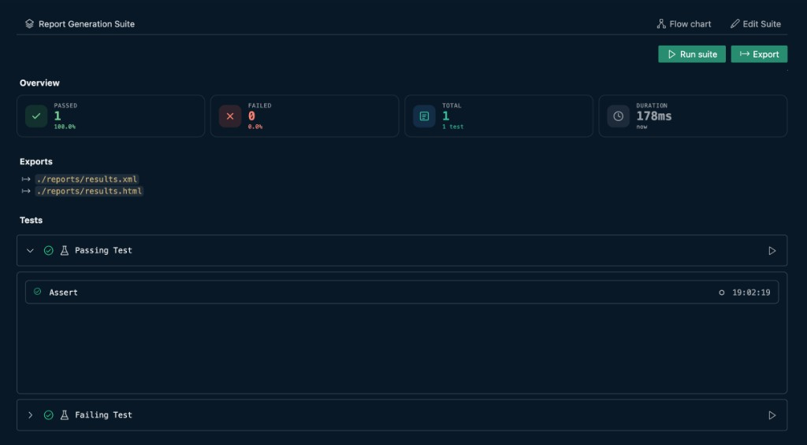

# Reports

After you run a suite, the **suite panel** shows the same **Overview** summary cards as the [test runner](../test/reports.md#summary-cards). They aggregate check/assert results across every suite item that ran.

## How suite counts differ

The four cards — **Passed**, **Failed**, **Total**, and **Duration** — use the same icons and colors described in [Reports (Test)](../test/reports.md#summary-cards). The sub-labels reflect suite scope:

| Card | Suite sub-label |
|---|---|
| **Total** | `N test` or `N tests` — number of suite items that produced reports |
| **Duration** | Relative start time of the suite run |

Passed and failed counts include every check/assert from all executed tests, APIs, and nested suites in the run (including partial subtree runs).

## Tests tree

Below the overview cards, the **Tests** section groups items by execution stage. Expand a test to see the same step **Report** list and status icons documented in [Reports (Test)](../test/reports.md#report-list).

Each item row also shows:

- A run-status icon ({{btn:pass}}, {{btn:error}}, {{btn:play-circle}}, and so on) — see [Step status icons](../test/reports.md#step-status-icons)
- A type icon (test, API, nested suite, mock server)
- {{btn:play}} **Run** for partial subtree execution

Use {{btn:export:Export}} on the run bar to export the combined suite report. See [Exports](./exports.md) and [Report files](../report/index.md).

---

See also: [Suite overview](./index.md) · [Execution](./execution.md) · [Reports (Test)](../test/reports.md)
