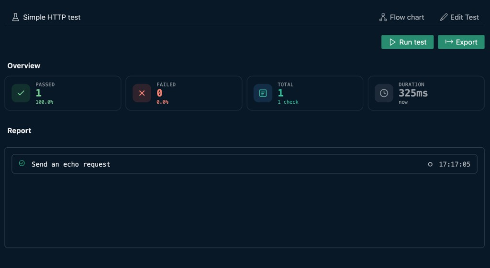

# Test

Use `type: test` to define a test MMT file. Open a test file in VS Code to get the **test runner** on the right (YAML stays on the left).



## YAML editor

Run glyphs appear in the left margin of the YAML pane:

| Control | What it does |
|---|---|
| {{btn:run}} on `type:` | Run the test through core (opens log output) |

## Test runner UI

### Top bar

| Control | What it does |
|---|---|
| `title` | Test title from `title:` (shown with the beaker icon) |
| {{btn:type-hierarchy-sub:Flow chart}} | Opens the flowchart view for the test steps |
| {{btn:edit:Edit Test}} | Switches to **edit mode** — see [Edit Test](./edit.md) |

### Run bar

| Control | What it does |
|---|---|
| {{btn:play:Run test}} | Runs the test flow. While running, turns into **Stop test** |
| Right-click Run test | Context menu: **Run in Core** |
| {{btn:export:Export}} | Export the run report (HTML, MMT, Markdown, or JUnit XML). Disabled until a run completes |

### After a run

| Section | What you see |
|---|---|
| `inputs` | Runtime input values when the test defines `inputs:` |
| `outputs` | Extracted output values when the test defines `outputs:` |
| **Overview** | **PASSED**, **FAILED**, **TOTAL**, and **DURATION** summary cards — see [Reports](./reports.md) |
| **Report** | Step-by-step results with pass/fail status and timestamps — see [Reports](./reports.md#report-list) |

## Supported

- Step types: [call](./steps/call.md), [http](./steps/http.md), [run](./steps/run.md), [check](./steps/check.md), [assert](./steps/assert.md), [expect](./steps/run-expect.md)
- [Control flow](./steps/control-flow.md): `if`, `for`, `repeat`, `delay`
- [Stages](./stages/index.md) with parallel execution
- [import](./import.md) · [cache](./cache.md) · [js](./steps/js.md) · [Variables](./steps/variables.md)

Multimeter can also run `.http`, `.https`, and `.bru` files as test flows through the optional VS Code **Open With...** editors. See [HTTP Files](../../integration/http-files/index.md) and [Bruno Files](../../integration/bruno-files/index.md).

Sample:

```yaml
type: test
title: Simple HTTP test
description: Calls an HTTP endpoint directly and checks the response
steps:
  - http: https://test.mmt.dev/echo
    title: Send an echo request
    method: post
    body:
      message: hello world
    expect:
      status: 200
      body.body.message: hello world
```

## Test elements

- [Quick start](./quick-start.md) · [Edit Test](./edit.md) · [Reports](./reports.md) · [Report overview](../report/index.md) · [Write a test flow](../../tasks/write-test-flow.md)
- [import](./import.md) · [cache](./cache.md)
- [Steps](./steps/index.md) · [Stages](./stages/index.md)
- [Stage condition](./stages/stage-condition.md) · [Complete example](./complete-example.md) · [CLI](./cli.md) · [Reference](./reference.md)
