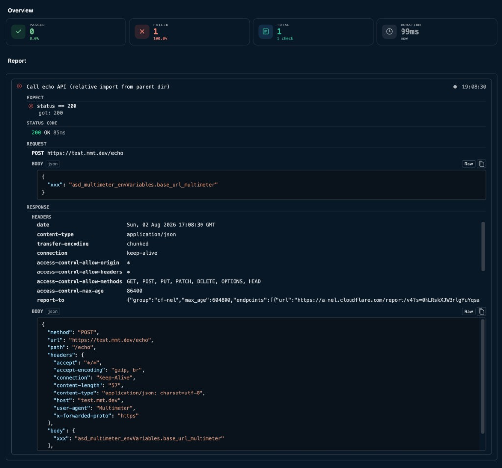

# Reports

After you run a test, the **test runner** shows an **Overview** row of summary cards above the step **Report**. The cards update as checks and asserts complete and stay visible until the next run.

## Summary cards

Four cards appear in a responsive grid (one column on narrow panels, up to four across on wide panels):

| Card | Icon | What it shows |
|---|---|---|
| **Passed** | Green checkmark | Number of check/assert steps that passed. Sub-label: pass rate (for example `100.0%`). |
| **Failed** | Red X | Number of steps that failed. Sub-label: fail rate (for example `0.0%`). |
| **Total** | Blue list | Total check/assert steps reported so far. Sub-label: `N check` or `N checks`. |
| **Duration** | Gray clock | Wall-clock run time (for example `0.123s`). Sub-label: when the run started (relative time, for example `2 min ago`). |

Cards use VS Code testing colors: green for passed, red for failed, blue for total, gray for duration.

While a run is in progress, counts and duration update live. Before the first run, the Overview section is hidden.

## Report list

Below the overview cards, the **Report** section lists every check, assert, and debug step from the run.

Use the **filter** control on the **Report** header to show **All**, **Passed**, or **Failed** steps. This is view-only — it does not change what ran or what gets exported.

### Step status icons

Each row starts with a status icon:

| Icon | Meaning |
|---|---|
| {{btn:pass}} | Step passed |
| {{btn:error}} | Step failed |
| {{btn:play-circle}} | Step is running |
| {{btn:stop-circle}} | Run was cancelled |
| {{btn:warning}} | Step error (invalid configuration or runtime error) |
| {{btn:debug}} | Debug output |
| {{btn:compass}} | Pending (not started yet) |

When a step reused a cached call result, the pass/fail icon switches to a database-style glyph to indicate **served from cache**.

### Step details

| Control | What it does |
|---|---|
| Step title | From the step's `title:` in YAML, or **Check** / **Assert** / **Debug** when no title is set |
| {{btn:circle-outline}} / {{btn:circle-filled}} | Expand or collapse expect comparisons, request/response details, and other output |
| Timestamp | Local time when the step reported (right side of the row) |

Expanded **Expect** rows show the comparison expression (for example `status == 200`) with a per-expect pass/fail icon. Failed expects also show **got:** actual vs expected values, and similarity or count when relevant.

For **call** steps, expanded details can include status code, request, response headers/body, and extracted outputs.

## Export

Use {{btn:export:Export}} on the run bar to save the full report (HTML, MMT, Markdown, or JUnit XML) after a run completes. See [Report overview](../report/index.md) for export formats and CI usage.

---

See also: [Test overview](./index.md) · [Report overview](../report/index.md) · [Edit Test](./edit.md)
