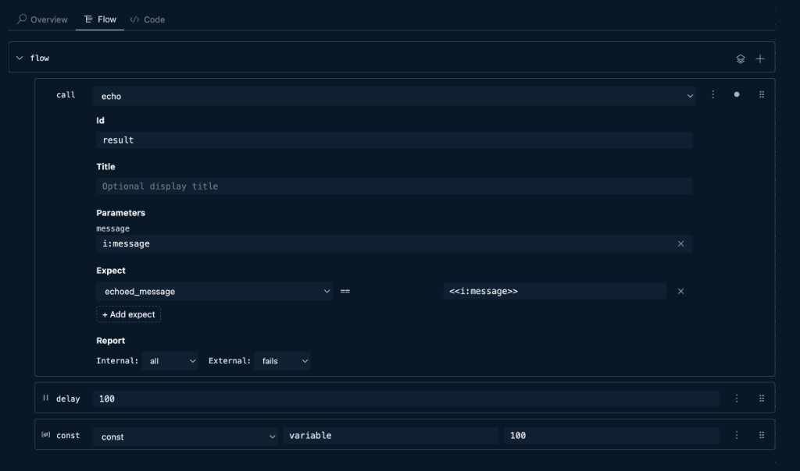

# Steps

Steps are the building blocks of a test. When placed at the test root, they run sequentially. Inside [stages](../stages/index.md), steps run within that stage; parallelism is controlled by the stages.

Use `call` when the request or flow already lives in a reusable imported file, and use `http` when you want to send a one-off HTTP request directly from the test. You can visualize and run the flow from the **Flow** view; each step here corresponds to a UI block in that view.

| Step type | What it does |
|---|---|
| [call](./call.md) | Invoke an imported API or test |
| [http](./http.md) | Send a one-off HTTP request |
| [run](./run.md) | Start an imported mock server |
| [Inline expect](./run-expect.md) | Validate call outputs on the same step |
| [check](./check.md) | Validate values; log failures and continue |
| [assert](./assert.md) | Validate values; stop the flow on failure |
| [Control flow](./control-flow.md) | `if`, `for`, `repeat`, `delay` |
| [js](./js.md) | Inline JavaScript |
| [Variables](./variables.md) | `print`, `set`, `var`, `const`, `let`, `setenv`, `data` |

For multi-stage flows with parallel execution, see [Stages](../stages/index.md).
