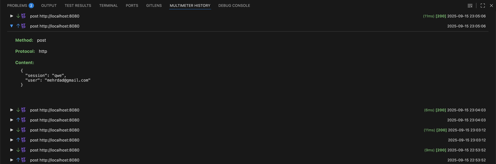

# History

See and inspect recent requests and responses made from the Multimeter UI and CLI.

Use the History panel to review what was sent, what came back, and how long it took—handy for debugging, demos, and sharing context with teammates.

## What you can use it for
- Troubleshoot failing or flaky calls (status, duration, headers, body)
- Compare multiple runs while iterating on an API
- Keep a quick, local trail of interactions during a session
- Share a snapshot (copy details) for support or review

## How it works
- Every request you send from the API editor (and supported actions) is recorded
- Entries show method, URL, status code, duration, and timestamp
- Select an entry to see details:
  - Request: method, URL, headers, cookies, and body
  - Response: status, headers, cookies, and body

## Panel controls
- Filter/search (when available): narrow the list by method, status, or text
- Delete: remove a single history entry
- Clear History: remove all entries

## Tips
- Use History alongside the Environment presets to confirm you’re hitting the right base URL
- Sort by timestamp or status (when available) to spot regressions quickly
- Copy request/response snippets to share with teammates or to build test cases

## Notes and limits
- History is local to your workspace; it isn’t synced or persisted across machines
- Very large bodies may be truncated in the panel for performance
- Sensitive data can appear in history—use Clear History when needed
