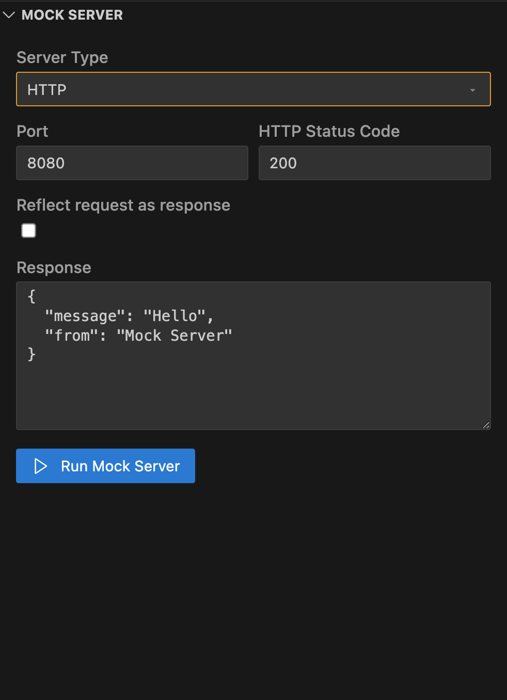

# Mock Server

A lightweight mock server built into Multimeter to prototype and test clients without a live backend.

Use it during development to inspect requests, echo (reflect) them back, and simulate simple responses for HTTP and WebSocket.

## What you can use it for
- Frontend/mobile prototyping before the real API is ready
- Contract checks while iterating on request/response shapes
- Offline development and demos
- Point tests or tools at a predictable local endpoint

## Supported protocols
- HTTP: receive requests on a local port and reply with a simple body/status
- WebSocket: accept connections and echo frames (useful for client wiring and quick payload checks)

## Controls in the panel
- Port: the local port to listen on (e.g., 8081)
- Reflect: when enabled, the server echoes back what it receives
  - HTTP: response body includes method, path, headers, and body you sent
  - WS: incoming frames are sent back to the same client
- Status: optional response status for HTTP (for example, 200, 400, 500)
- Content type: pick a content type for the HTTP response body (json/xml/text)

Tip: Reflect is a great way to validate what your client actually sends—no backend needed.

## Point your client or tests to it
- In your API `.mmt`, set the base URL to the mock server, for example:
  - url: http://localhost:8081
- Or use an environment variable and swap presets between real and mock:
  - variables.API_URL: http://localhost:8081
  - tests and APIs reference it via <e:API_URL>

When Reflect is on, you’ll see the same payload you sent in the response body. Turn it off and set a Status to simulate error paths.

## Notes and limits
- Designed for local development—don’t expose publicly
- State is not persisted between runs
- Response shaping is basic by design; for complex mocking, use an external tool and keep Multimeter for authoring/running tests
