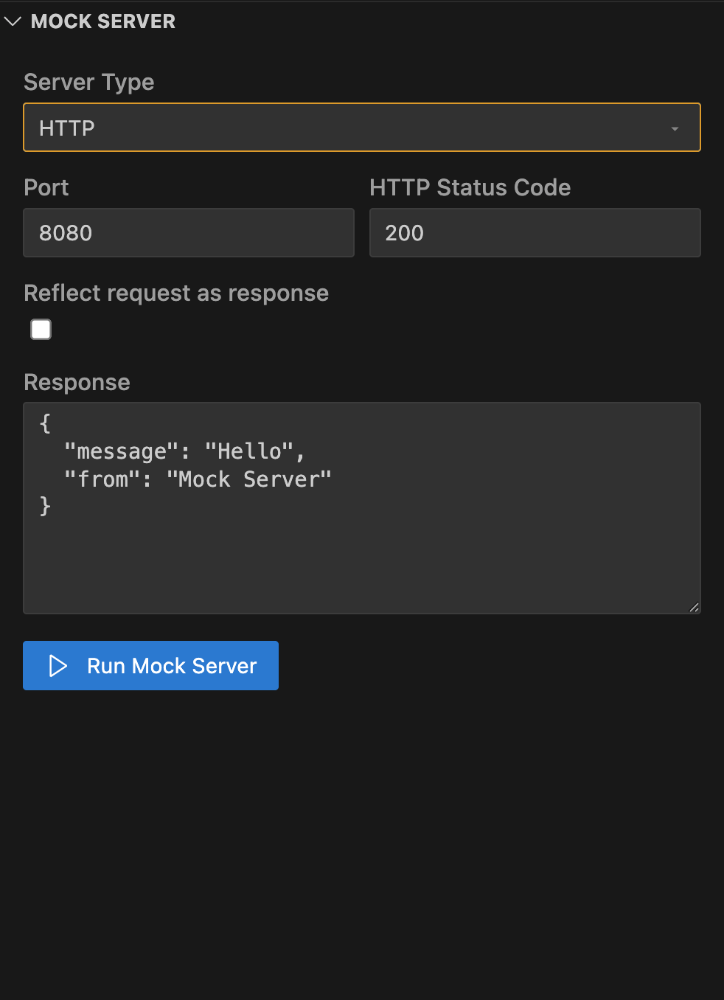

# Mock Server

A lightweight mock server built into Multimeter to prototype and test clients without a live backend.

Use it during development to inspect requests, echo (reflect) them back, and simulate simple responses for HTTP and WebSocket.



## What you can use it for
- Frontend/mobile prototyping before the real API is ready
- Contract checks while iterating on request/response shapes
- Offline development and demos
- Point tests or tools at a predictable local endpoint

## Supported protocols
- HTTP: receive requests on a local port and reply with a simple body/status
- WebSocket: accept connections and echo frames (useful for client wiring and quick payload checks)

## Controls in the panel
- Port: the local port to listen on (e.g., 8081)
- Reflect: when enabled, the server echoes back what it receives
  - HTTP: response body includes method, path, headers, and body you sent
  - WS: incoming frames are sent back to the same client
- Status: optional response status for HTTP (for example, 200, 400, 500)
- Content type: pick a content type for the HTTP response body (json/xml/text)

Tip: Reflect is a great way to validate what your client actually sends -- no backend needed.

## Point your client or tests to it
- In your API `.mmt`, set the base URL to the mock server, for example:
  - url: http://localhost:8081
- Or use an environment variable and swap presets between real and mock:
  - variables.API_URL: http://localhost:8081
  - tests and APIs reference it via `<<e:API_URL>>`

When Reflect is on, you will see the same payload you sent in the response body. Turn it off and set a Status to simulate error paths.

## Request history
The mock server records each incoming request. Use the history view to inspect:
- Method, URL, headers, and body of each request
- Timestamp and order of arrival

This is useful for verifying that your client sends the correct payloads without needing an external tool.

## Notes and limits
- Designed for local development -- do not expose publicly
- State is not persisted between runs
- Response shaping is basic by design; for complex mocking, use an external tool and keep Multimeter for authoring/running tests

---

## HTTPS / TLS

The Mock Server panel can run an HTTPS server on localhost.

- Set **Server Type** to **HTTPS**.
- Select a **server certificate** file (PEM/CRT).
- Select a **server key** file (PEM/KEY).

### mTLS (client certificate verification)

To require clients to present a valid certificate (mutual TLS):

- Enable **Require client certificate (mTLS)**.
- Select a **Client CA** file (PEM) that signed the client certificates you want to accept.

When mTLS is enabled:
- The server will request a client certificate from connecting clients.
- Clients without a valid certificate signed by the configured CA will be rejected.

### Testing TLS and mTLS with curl

**TLS only (server cert, no client cert):**
```sh
curl --cacert certs-test/ca.crt https://127.0.0.1:8080/
```

**mTLS (client cert required):**
```sh
curl --cacert certs-test/ca.crt \
     --cert certs-test/client.crt \
     --key certs-test/client.key \
     https://127.0.0.1:8080/
```

### Notes
- The server binds to `127.0.0.1`.
- Certificate file paths are stored in VS Code workspace state and persist across restarts.
- Only PEM format is supported (`.pem`, `.crt`, `.cer`, `.key`).
- Most HTTP clients will need to trust the server certificate (add the CA to `certificates.ca` or disable validation where appropriate).
