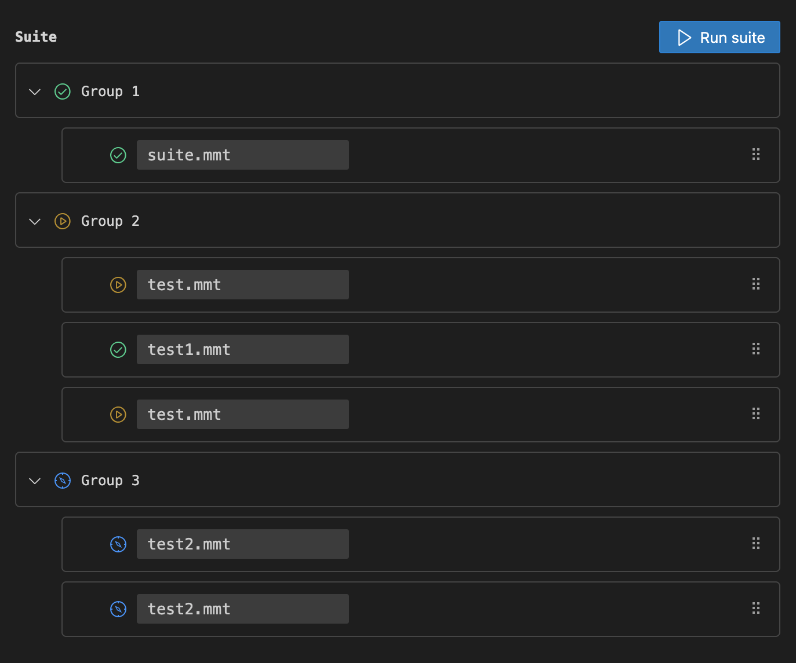

# Suite

Use `type: suite` to define a suite MMT file. A suite allows you to run multiple tests together. Under the hood, Multimeter executes each test file specified in the suite.

Example:

```yaml
type: suite
title: Smoke Tests
tags:
  - smoke
tests:
  - test/login_and_get_user_info.mmt
  - test/create_session.mmt
  - test/get_user_info.mmt
```

## Elements

### title, description, tags
You can use these fields for documentation and to help with searching and filtering suites.

- `title`: The title of the suite.
- `description`: A short explanation of what the suite does.
- `tags`: An array of strings to categorize the suite.

### tests
The `tests` property is an array of strings, where each string is a path to a `.mmt` file. A suite can run any combination of APIs, tests, or even other suites. The paths are relative to the suite file's location.

```yaml
tests:
  - ../apis/login.mmt
  - ../tests/login_and_get_user_info.mmt
  - ../suites/smoke_tests.mmt
```

### Sequential and Parallel Execution
By default, all tests listed in the `tests` array will run in parallel. To control the flow and run tests in sequential stages, use `then` to separate the groups of tests. All tests between `then` separators form a group that runs in parallel. The groups themselves run sequentially, one after the other.

```yaml
type: suite
title: Sequential and Parallel Execution Example
tests:
  - test1.mmt
  - test2.mmt
  - then
  - test3.mmt
  - test4.mmt
  - then
  - test5.mmt
```

In the example above, the execution flow is as follows:
1. `test1.mmt` and `test2.mmt` start running in parallel.
2. The suite waits for both `test1.mmt` and `test2.mmt` to complete.
3. `test3.mmt` and `test4.mmt` start running in parallel.
4. The suite waits for both `test3.mmt` and `test4.mmt` to complete.
5. `test5.mmt` is run.

## UI and Execution

When you open a suite file, the Multimeter panel displays the items in the suite, grouped by execution stage. Each item is shown with its name and an icon that indicates its type.

- **API**: Represented by an icon indicating the protocol (e.g., HTTP, WebSocket).
- **Test**: Represented by a test icon.
- **Suite**: Represented by a suite icon, indicating a nested suite.

This visual representation helps you understand the structure of your suite at a glance. You can run the entire suite from this panel.

Here is a sample of the UI for running a suite:
