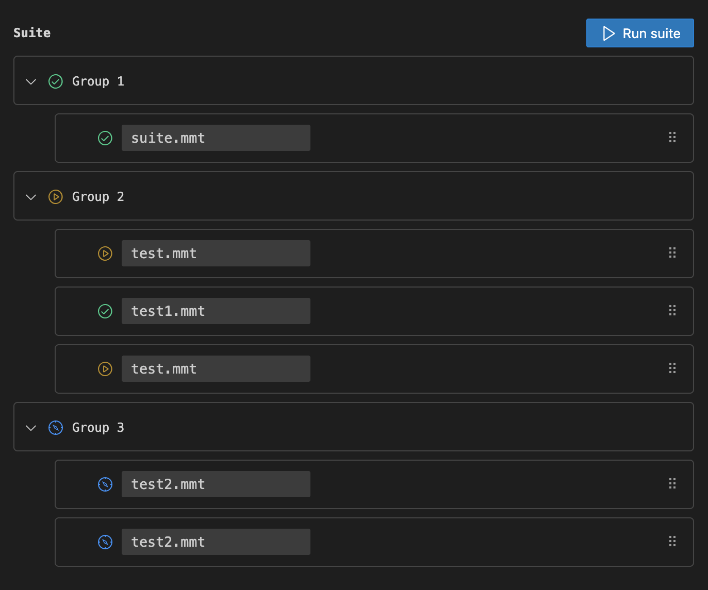

# Suite

Use `type: suite` to define a suite MMT file. A suite allows you to run multiple tests together. Under the hood, Multimeter executes each test file specified in the suite.

Example:

```yaml
type: suite
title: Smoke Tests
tags:
  - smoke
tests:
  - test/login_and_get_user_info.mmt
  - test/create_session.mmt
  - test/get_user_info.mmt
```

## Elements

### title, description, tags
You can use these fields for documentation and to help with searching and filtering suites.

- `title`: The title of the suite.
- `description`: A short explanation of what the suite does.
- `tags`: An array of strings to categorize the suite.

### tests
The `tests` property is an array of strings, where each string is a path to a `.mmt` file. A suite can run any combination of APIs, tests, or even other suites.

Paths can be:
- **Relative** to the suite file's location (e.g., `../tests/login.mmt`)
- **Project root** paths using `+/` prefix (e.g., `+/tests/login.mmt`) — resolves relative to the directory containing `multimeter.mmt`

```yaml
tests:
  - ../apis/login.mmt
  - ../tests/login_and_get_user_info.mmt
  - +/tests/shared/setup.mmt           # project root import
  - ../suites/smoke_tests.mmt
```

See [Environment — Project Root Marker](./environment-mmt.md#project-root-marker) for details on setting up `multimeter.mmt`.

### Sequential and Parallel Execution
By default, all tests listed in the `tests` array will run in parallel. To control the flow and run tests in sequential stages, use `then` to separate the groups of tests. All tests between `then` separators form a group that runs in parallel. The groups themselves run sequentially, one after the other.

```yaml
type: suite
title: Sequential and Parallel Execution Example
tests:
  - test1.mmt
  - test2.mmt
  - then
  - test3.mmt
  - test4.mmt
  - then
  - test5.mmt
```

In the example above, the execution flow is as follows:
1. `test1.mmt` and `test2.mmt` start running in parallel.
2. The suite waits for both `test1.mmt` and `test2.mmt` to complete.
3. `test3.mmt` and `test4.mmt` start running in parallel.
4. The suite waits for both `test3.mmt` and `test4.mmt` to complete.
5. `test5.mmt` is run.

## UI and Execution

When you open a suite file, the Multimeter panel displays the items in the suite, grouped by execution stage. Each item is shown with its name and an icon that indicates its type.

- **API**: Represented by an icon indicating the protocol (e.g., HTTP, WebSocket).
- **Test**: Represented by a test icon.
- **Suite**: Represented by a suite icon, indicating a nested suite.

This visual representation helps you understand the structure of your suite at a glance. You can run the entire suite from this panel.

### Node types
Each item in the suite tree is shown with an icon indicating its type:
- **API**: HTTP or WebSocket API file
- **Test**: Test file with steps/stages
- **Suite**: A nested suite (suites can include other suites recursively)
- **Missing**: The referenced file could not be found at the specified path
- **Cycle**: A circular reference was detected (Suite A includes Suite B which includes Suite A)

The system automatically detects and prevents circular references. If a cycle is found, the offending entry is shown as a `cycle` node and is not executed.

### Partial runs (Run on an item)
The Suite panel also supports running a single item (or a subtree) from within the suite tree.

- Suite runs are executed via a **suite bundle**.
- Each runnable node in the bundle has an `id`.
- Clicking **Run** on a node sends that node `id` as `target` to the extension host.
- Core executes the subtree rooted at `target` and emits reports tagged with the same `id` so the UI routes output to the correct item.

If you see output appear under the wrong item, it usually means report events are being routed without using `id` (or a per-run `runId`).

Here is a sample of the UI for running a suite:


## Running suites from the CLI

Use `testlight` to run a suite from the command line or CI:

```sh
testlight run path/to/suite.mmt --env-file env.mmt --preset dev
```

The suite runner executes stages sequentially. Within each stage (items between `then` separators), tests run in parallel. Results are reported per item.

---

## Reference (types)
- type: `suite`
- title: string
- description: string (supports Markdown)
- tags: string[]
- tests: string[] (paths to `.mmt` files; use `then` to separate sequential stages)

---

## See also
- [Test](./test-mmt.md) — define test flows that suites can run
- [API](./api-mmt.md) — define APIs that suites can run directly
- [Environment](./environment-mmt.md) — variables and presets, including `+/` project root imports
- [Testlight CLI](./testlight.md) — run suites from the command line
- [Sample Project](./sample-project.md) — full walkthrough with APIs, tests, suites, and docs