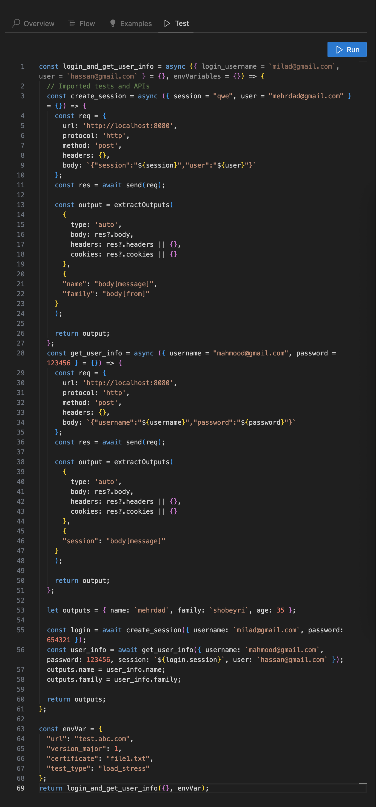
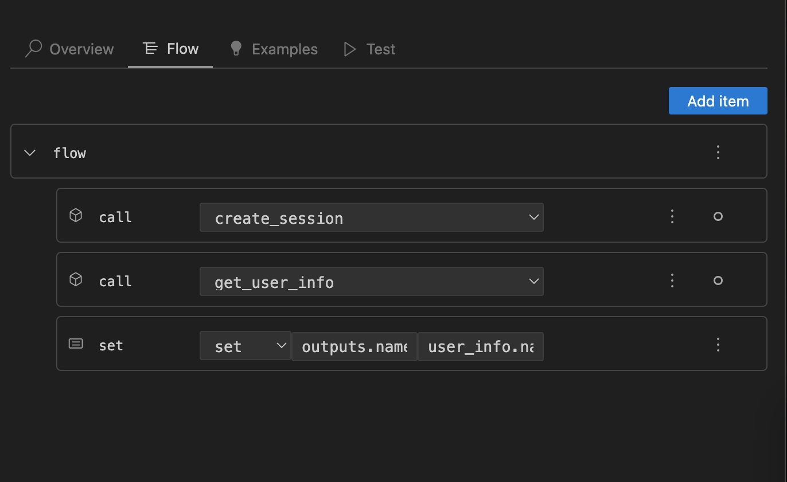
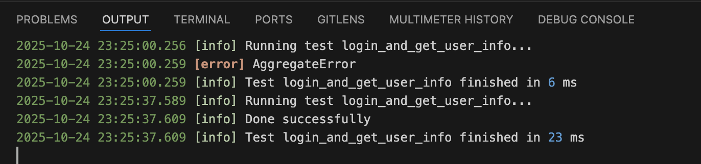

# Test

Usage-first guide for writing test `.mmt` files: steps, stages, metrics, inputs/outputs, and examples.

Supported tokens
- Environment: `e:VAR`, `<e:VAR>`, `<<e:VAR>>`
- Inputs: `<i:key>` (use inside url/headers/body)

## Example: YAML to auto-generated JS
The JS that runs is automatically generated from your YAML. You can generate and run it directly by clicking the Run button in the Test panel.

YAML
```yaml
type: test
title: login_and_get_user_info
tags: []
import:
  create_session: create_session.mmt
  get_user_info: get_user_info.mmt
inputs:
  login_username: milad@gmail.com
  user: hassan@gmail.com
outputs:
  name: mehrdad
  family: shobeyri
  age: 35
steps:
  - call: create_session
    id: login
    inputs:
      username: i:login_username
      password: 654321
  - call: get_user_info
    id: user_info
    inputs:
      username: mahmood@gmail.com
      password: 123456
      session: ${login.session}
      user: i:user
  - set:
      outputs.name: user_info.name
      outputs.family: user_info.family
```

Test panel (click Run to execute):



## Stages
Stages let you run groups of steps in parallel. All stages start concurrently; use dependencies to control order. If you have a single linear flow, you can skip stages and place steps at the test root.

```yaml
stages:
  - id: login
    name: Login Stage
    steps:
      - call: login
        id: doLogin
  - id: profile
    dependencies: login   # or
                          #   - login
                          #   - anotherStage
    condition: doLogin.status == 200  # optional guard
    steps:
      - call: getUser
        id: me
        inputs:
          token: doLogin.token
```

## Steps
Steps are the building blocks of a test. When placed at the test root, they run sequentially. Inside stages, steps run within that stage; parallelism is controlled by the stages.

## Define a test
```yaml
 type: test
 title: Login and fetch profile
 tags:
   - auth
 description: Validate login flow then load user profile
 import:
   users: ./users.csv      # CSV alias
 inputs:
   user: string
   pass: string
 outputs:
   token: string
 metrics:
   repeat: "3"            # or a number; can combine with threads/duration
   threads: 2
   duration: 30s
   rampup: 5s
 steps: []                 # or use stages: []
```

Create and inspect tests from the Test panel in the UI; fields map directly to the YAML shown above.

## Steps

You can visualize and run the flow from the Flow panel; each step here corresponds to a UI block in that panel.

You can visualize and run the flow from the Flow panel; each step here corresponds to a UI block in that panel.



### call
Invoke an imported API or another test; give it an id to reference its outputs later.
```yaml
# call an API named login
- call: login
  id: doLogin
  inputs:
    username: <i:user>
    password: <i:pass>

# call another test named getUser
- call: getUser
  id: profile
  inputs:
  token: doLogin.token
```

### check and assert
Use check to log a failure and continue; use assert to stop the flow on failure.

Supported operators
- `<`, `>`, `<=`, `>=`, `==`, `!=`, `=@` (contains), `!@` (not contains), `=^` (starts with), `!^` (not starts with), `=$` (ends with), `!$` (not ends with), `=~` (regex), `!~` (not regex)

Examples
```yaml
- assert: doLogin.status == 200
- check: profile.name =~ /John/i
```

Checks, assertions, prints, and errors appear in the Log panel while the flow runs.



### if or else
Conditionally run nested steps based on an expression.
```yaml
- if: doLogin.status == 200
  steps:
    - call: getUser
      id: me
  else:
    - print: "Login failed"
```

### for or repeat
for runs with a JavaScript-style header (e.g., `const user of users`) and executes the inner steps per item. repeat runs the inner steps a fixed number of times (or time-based if supported).
```yaml
# iterate imported CSV rows (from import:
#   users: ./users.csv)
- for: const user of users
  steps:
    - call: login
      id: login1
      inputs:
        username: user.username
        password: user.password

# repeat N times (or "inf")
- repeat: 3
  steps:
    - call: poll
    - delay: 2s
```

### delay
Pause the flow for a duration.
```yaml
- delay: 500    # ms
- delay: 2s     # units: ns|ms|s|m|h
```

### js
Run inline JavaScript for custom logic or logging.
```yaml
- js: |
    const t = Date.now();
    console.log('ts', t);
```

### print
Write a message to the log output.
```yaml
- print: "Starting flow"
```

### set, var, const, or let
Create or change variables for later steps. set mutates existing or creates new; var/const/let follow JS scoping.
```yaml
- set:
  token: doLogin.token   # mutable
- var:
  attempt: 1
- const:
  role: "admin"
- let:
  note: "temp"
```

### data
Bind an imported CSV alias (from the test's import section) into scope for use in loops and steps.
```yaml
- data: users   # where import:
                #   users: ./users.csv
```


## Metrics (simple load controls, under develop)
```yaml
metrics:
  repeat: "100"   # or number or "inf"
  threads: 5
  duration: 60s
  rampup: 10s
```

## Inputs and outputs (test level)
- Declare inputs you expect to receive and outputs you plan to produce at the test level.
```yaml
inputs:
  user: string
  pass: string
outputs:
  token: string
```
Use `<i:key>` inside steps to substitute test inputs:
```yaml
- call: login
  id: doLogin
  inputs:
    username: <i:user>
    password: <i:pass>
```

## Complete example
```yaml
 type: test
 title: Login + Profile
 import:
   users: ./users.csv
 inputs:
   user: string
   pass: string
 steps:
  - call: login
    id: doLogin
    inputs:
      username: <i:user>
      password: <i:pass>
  - assert: doLogin.status == 200
  - set:
      token: doLogin.token
  - delay: 2s
  - call: getUser
    id: me
    inputs:
      token: token
  - check: me.email =~ /@example.com$/
```

## Reference (types)
- type: `test`
- title: string
- tags: string[]
- description: string
- import: record<string,string> (CSV)
- inputs: record<string, string|number|boolean|null>
- outputs: record<string, string|number|boolean|null>
- metrics: { repeat?: string|number, threads?: number, duration?: Timestr, rampup?: Timestr }
- steps: array of step
- stages: array of { id, name?, steps, condition?, dependencies? }
- step types: `call`, `check`, `assert`, `if`, `for`, `repeat`, `delay`, `js`, `print`, `set`, `var`, `const`, `let`, `data`
