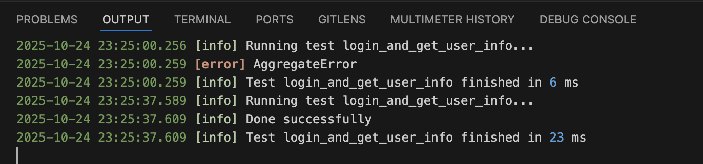

# Test

Use `type: test` to define a test MMT file. You can build complex flows with the elements below. Under the hood, Multimeter compiles your MMT to JavaScript and runs it inside VS Code or in CI with `testlight`.

Example:

```yaml
type: test
title: Login and get user info
tags:
  - smoke
import:
  create_session: create_session.mmt
  get_user_info: get_user_info.mmt
inputs:
  login_username: milad@gmail.com
  user: hassan@gmail.com
outputs:
  name: mehrdad
  family: shobeyri
  age: 35
steps:
  - call: create_session
    id: login
    inputs:
      username: i:login_username
      password: 654321
  - call: get_user_info
    id: user_info
    inputs:
      username: mahmood@gmail.com
      password: 123456
      session: ${login.session}
      user: i:user
  - set:
      outputs.name: user_info.name
      outputs.family: user_info.family
```

For the provided MMT, the Test panel shows the generated JavaScript. Click Run to execute the test.


## Elements
The `test` type also supports documentation fields (title, tags, description) and reuse/compose elements (import, inputs, outputs). See the API doc for details. The sections below cover flow elements.

### Stages
Stages let you run groups of steps in parallel. All stages start concurrently; use dependencies to control order. If you have a single linear flow, you can skip stages and place steps at the test root.

```yaml
stages:
  - id: login
    name: Login Stage
    steps:
      - call: login
        id: doLogin
  - id: profile
    dependencies: login   # or
                          #   - login
                          #   - anotherStage
    steps:
      - call: getUser
        id: me
        inputs:
          token: doLogin.token
```

### Steps
Steps are the building blocks of a test. When placed at the test root, they run sequentially. Inside stages, steps run within that stage; parallelism is controlled by the stages.
You can visualize and run the flow from the Flow panel; each step here corresponds to a UI block in that panel.


### call
Invoke an imported API or another test; give it an id to reference its outputs later.
```yaml
# call an API named login
- call: login
  id: doLogin
  inputs:
    username: i:user
    password: i:pass

# call another test named getUser
- call: getUser
  id: profile
  inputs:
  token: doLogin.token
```

### check, assert
Use check to log a failure and continue; use assert to stop the flow on failure.

Supported operators
- `<`, `>`, `<=`, `>=`, `==`, `!=`, `=@` (contains), `!@` (not contains), `=^` (starts with), `!^` (not starts with), `=$` (ends with), `!$` (not ends with), `=~` (regex), `!~` (not regex)

Examples
```yaml
- assert: doLogin.status == 200
- check: profile.name =~ /John/i
```

Checks, assertions, prints, and errors appear in the Log panel while the flow runs.



### if, else
Conditionally run nested steps based on an expression.
```yaml
- if: doLogin.status == 200
  steps:
    - call: getUser
      id: me
  else:
    - print: "Login failed"
```

### for, repeat
for runs with a JavaScript-style header (for example, `const user of users`) and executes the inner steps per item. repeat runs the inner steps a fixed number of times (or time-based).
```yaml
# iterate imported CSV rows (from import:
#   users: ./users.csv)
- for: const user of users
  steps:
    - call: login
      id: login1
      inputs:
        username: user.username
        password: user.password

# repeat N times
- repeat: 3
  steps:
    - call: poll
    - delay: 2s
```

### delay
Pause the flow for a duration.
```yaml
- delay: 500    # ms
- delay: 2s     # units: ns|ms|s|m|h
```

### js
Run inline JavaScript for custom logic or logging.
```yaml
- js: |
    const t = Date.now();
    console.log('ts', t);
```

### print
Write a message to the log output.
```yaml
- print: "Starting flow"
```

### set, var, const, or let
Create or change variables for later steps. set mutates existing (or creates new); var/const/let follow JS scoping.
```yaml
- set:
  token: doLogin.token   # mutable
- var:
  attempt: 1
- const:
  role: "admin"
- let:
  note: "temp"
```

### data
Bind an imported CSV alias (from the test's import section) into scope for use in loops and steps.
```yaml
- data: users   # where import:
                #   users: ./users.csv
```

## Complete example
```yaml
type: test
title: Login + Profile
import:
  users: ./users.csv
inputs:
  user: string
  pass: string
steps:
  - call: login
    id: doLogin
    inputs:
      username: i:user
      password: i:pass
  - assert: doLogin.status == 200
  - set:
      token: doLogin.token
  - delay: 2s
  - call: getUser
    id: me
    inputs:
      token: token
  - check: me.email =~ /@example.com$/
```

## Reference (types)
- type: `test`
- title: string
- tags: string[]
- description: string
- import: record<string, string> (CSV)
- inputs: record<string, string | number | boolean | null>
- outputs: record<string, string | number | boolean | null>
- metrics: repeat?: string | number, threads?: number, duration?: string, rampup?: string
- steps: array of step
- stages: array of { id, name?, steps, condition?, dependencies? }
- step types: `call`, `check`, `assert`, `if`, `for`, `repeat`, `delay`, `js`, `print`, `set`, `var`, `const`, `let`, `data`
